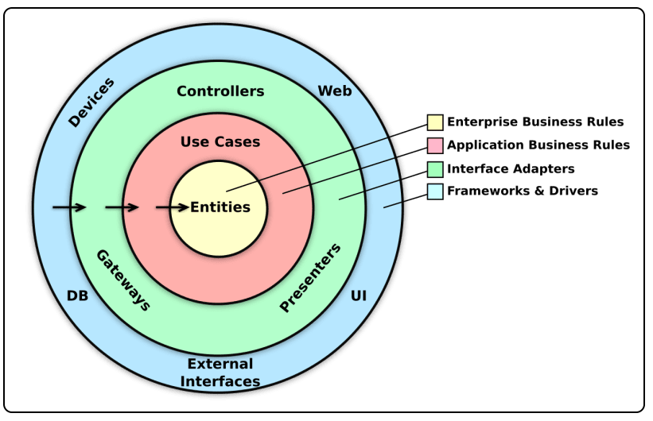

# 🛠️ Exploring Clean Architecture: A Practical Guide 📖

Clean Architecture is a software design approach that separates system responsibilities into well-defined layers. This modular structure simplifies maintenance and scalability, promoting **separation of concerns** and facilitating code comprehension and modifications. Let's explore how each layer works and why it matters.

Imagine a scenario where your system needs to support a new database or a different user interface. With Clean Architecture, such changes become easier to handle, as core business logic remains unaffected by external dependencies. As Uncle Bob emphasizes, the center of your application should be the **use cases** and business logic, not frameworks or databases.



## Why Choose Clean Architecture?

Clean Architecture helps mitigate several common architectural problems:

- **Early Commitments**: Traditional architectures often force teams to make crucial decisions at the start of a project when understanding of the problem domain is minimal. Clean Architecture encourages **deferring decisions** about frameworks, databases, and other details until they are necessary, keeping the design open to change as requirements evolve.
- **Rigid and Hard-to-Change Systems**: Without a clean structure, new requirements often require either a "hacky" solution or a costly redesign. By decoupling business rules from implementation details, Clean Architecture makes the system easier to adapt and extend.
- **Framework-Centric Design**: Frameworks should be tools, not the architecture itself. They can evolve and introduce breaking changes, but if your system is framework-agnostic, it won’t be affected as severely. Uncle Bob emphasizes that frameworks are details and should be kept at the periphery.
- **Database-First Thinking**: Many systems are built around the database, turning everything into CRUD operations. Clean Architecture treats the database as just another data provider, ensuring that business logic remains database-agnostic.
- **Scattered Business Logic**: When business rules are spread across multiple layers, understanding or modifying behavior becomes difficult. Clean Architecture centralizes business logic within **use cases**, making it easy to locate and maintain.
- **Slow and Brittle Tests**: Coupling business logic with the UI or database can make testing slow and fragile. Clean Architecture promotes decoupling, enabling fast, reliable unit tests that focus on core logic.

## Key Concepts of Clean Architecture

### 1. Separating Concerns for Flexibility
Clean Architecture organizes responsibilities into distinct layers, reducing dependencies and making maintenance easier. Each layer has a specific role, resulting in a more predictable and organized codebase.

### 2. Domain-Centric Design
The domain layer is the core of the system, encapsulating **business logic** and essential entities. It is independent of other layers, adhering closely to business requirements and simplifying unit testing.

### 3. Use Cases and Application Logic
Use cases are **application-specific business rules** that coordinate interactions between entities. They handle input and output while remaining unaware of data sources or presentation details.

- **Request and Response Models**: Use simple data structures to decouple use cases from frameworks, keeping core logic focused and testable.
- **CQRS (Command Query Responsibility Segregation)**: The CQRS pattern separates data reading and writing operations, optimizing performance and making code clearer. This approach ensures that the application layer handles business logic without infrastructure concerns.

### 4. Infrastructure as a Plugin
The infrastructure layer manages external integrations, such as databases and messaging systems, hiding implementation details from the rest of the application. Treating infrastructure as **plugins** makes replacing or modifying technology easier without impacting business logic.

- **Hexagonal Architecture**: Also known as Ports and Adapters, this pattern emphasizes a clean separation between the core and external systems, enhancing flexibility.

### 5. Presentation Layer: The User Interface
The presentation layer handles user interaction, often through RESTful APIs or gRPC. It delegates business logic to the application layer, focusing only on input and output.

### 6. Dependency Injection
Dependency injection is crucial for maintaining architecture integrity. It controls dependencies between layers, enabling flexibility and simplifying testing.

## Practical Example: Layers and Functionality

Let's break down each layer with practical examples.

### Domain Layer

The **Domain Layer** defines business entities and core rules. For instance, a `Webinar` entity might look like this:

```csharp
public class Webinar
{
    public Guid Id { get; private set; }
    public string Name { get; private set; }
    public DateTime ScheduledOn { get; private set; }

    public Webinar(string name, DateTime scheduledOn)
    {
        Id = Guid.NewGuid(); // Generates a unique identifier for the webinar
        Name = name;
        ScheduledOn = scheduledOn;
    }

    public void Reschedule(DateTime newDate)
    {
        ScheduledOn = newDate;
    }
}
```
Entities are **self-contained** and evolve based on business needs, not on external system constraints. We also define **repository interfaces** and **custom exceptions**:

```csharp
public interface IWebinarRepository
{
    Task<Webinar?> GetById(Guid id, CancellationToken cancellationToken);

    Task Add(Webinar webinar, CancellationToken cancellationToken);
}


public class WebinarNotFoundException : Exception
{
    public WebinarNotFoundException(Guid webinarId)
        : base($"Webinar with ID {webinarId} was not found.") { }
}

```

### Application Layer

The **Application Layer** manages use cases and implements **CQRS** to separate commands and queries, ensuring efficiency.

**`CreateWebinarCommand` Command:**

```csharp
public class CreateWebinarCommand : IRequest<Guid>
{
    public string Name { get; set; }
    public DateTime ScheduledOn { get; set; }
}
```

**`CreateWebinarCommandHandler` Handler:**

```csharp
public class CreateWebinarCommandHandler : IRequestHandler<CreateWebinarCommand, Guid>
{
    private readonly IWebinarRepository _repository;

    public CreateWebinarCommandHandler(IWebinarRepository repository)
    {
        _repository = repository;
    }


    public async Task<Guid> Handle(CreateWebinarCommand command, CancellationToken cancellationToken)
    {
        var webinar = new Webinar(command.Name, command.ScheduledOn);
        await _repository.Add(webinar, cancellationToken);
        return webinar.Id;
    }
}
```

**`GetWebinarByIdQuery` Query:**

```csharp
public class GetWebinarByIdQuery : IRequest<Webinar?>
{
    public Guid Id { get; set; }
}

```

**`GetWebinarByIdQueryHandler` Handler:**

```csharp
public class GetWebinarByIdQueryHandler : IRequestHandler<GetWebinarByIdQuery, Webinar?>
{
    private readonly IWebinarRepository _repository;

    public GetWebinarByIdQueryHandler(IWebinarRepository repository)
    {
        _repository = repository;
    }

    public async Task<Webinar?> Handle(GetWebinarByIdQuery request, CancellationToken cancellationToken)
    {
        var webinar = await _repository.GetById(request.Id, cancellationToken);
        if (webinar is null)
            throw new WebinarNotFoundException(request.Id);

        return webinar;
    }
}
```

This structure keeps use cases isolated and easily testable.

### Infrastructure Layer

The **Infrastructure Layer** handles external system integrations, like database access:

```csharp
public class WebinarRepository : IWebinarRepository
{
    private readonly AppDbContext _dbContext;

    public WebinarRepository(AppDbContext dbContext)
    {
        _dbContext = dbContext;
    }

    public async Task<Webinar?> GetById(Guid id, CancellationToken cancellationToken)
    {
        return await _dbContext.Webinars.FindAsync(id, cancellationToken);
    }

    public async Task Add(Webinar webinar, CancellationToken cancellationToken)
    {
        await _dbContext.Webinars.AddAsync(webinar, cancellationToken);
        await _dbContext.SaveChangesAsync(cancellationToken);
    }
}

```

By encapsulating this logic, the system remains flexible to technological changes.

### Presentation Layer

The **Presentation Layer** provides APIs for user interaction:

```csharp
[ApiController]
[Route("api/[controller]")]
public class WebinarsController : ControllerBase
{
    private readonly IMediator _mediator;

    public WebinarsController(IMediator mediator)
    {
        _mediator = mediator;
    }

    [HttpPost]
    public async Task<IActionResult> CreateWebinar([FromBody] CreateWebinarCommand command)
    {
        var webinarId = await _mediator.Send(command);
        return CreatedAtAction(nameof(GetWebinar), new { id = webinarId }, webinarId);
    }

    [HttpGet("{id}")]
    public async Task<IActionResult> GetWebinar(Guid id)
    {
        var query = new GetWebinarByIdQuery { Id = id };
        var webinar = await _mediator.Send(query);
        return Ok(webinar);
    }
}
```

By offloading logic to the application layer, this layer focuses on **handling requests and responses**.

### Centralized Error Handling with Middleware

Centralized error handling improves user experience and security:

```csharp
public class ExceptionHandlingMiddleware
{
    private readonly RequestDelegate _next;

    public ExceptionHandlingMiddleware(RequestDelegate next)
    {
        _next = next;
    }

    public async Task Invoke(HttpContext context)
    {
        try
        {
            await _next(context);
        }
        catch(WebinarNotFoundException ex)
        {
            context.Response.StatusCode = StatusCodes.Status404NotFound;
            await context.Response.WriteAsJsonAsync(new { Error = ex.Message });
        }
        catch (Exception ex)
        {
            context.Response.StatusCode = StatusCodes.Status500InternalServerError;
            await context.Response.WriteAsJsonAsync(new { Error = ex.Message });
        }
    }
}
```

### Dependency Registration in `Program.cs`

Configuring dependencies in `Program.cs`:

```csharp
var builder = WebApplication.CreateBuilder(args);

builder.Services.AddControllers()
                .AddApplicationPart(typeof(WebinarsController).Assembly);

builder.Services.AddScoped<IWebinarRepository, WebinarRepository>();

builder.Services.AddMediatR(cfg => cfg.RegisterServicesFromAssemblies(typeof(CreateWebinarCommandHandler).Assembly));

builder.Services.AddDbContext<AppDbContext>(options =>
           options.UseInMemoryDatabase("webinarsDb"));

builder.Services.AddEndpointsApiExplorer();
builder.Services.AddSwaggerGen();

var app = builder.Build();

app.UseMiddleware<ExceptionHandlingMiddleware>();

if (app.Environment.IsDevelopment())
{
    app.UseSwagger();
    app.UseSwaggerUI();
}

app.UseHttpsRedirection();

app.UseAuthorization();

app.MapControllers();

app.Run();
```

### Benefits and Trade-offs of Clean Architecture

- **Benefits**: 
  - Facilitates effective testing strategies.
  - Framework-agnostic design minimizes external dependencies.
  - Clear separation of business logic enhances comprehension and modification.
  - Supports incremental deployments and continuous integration.
- **Trade-offs**: 
  - **Complexity**: Introducing multiple boundaries can add overhead. Use boundaries wisely.
  - **Code Duplication**: Different representations of entities may seem redundant but promote decoupling.

### Conclusion

Clean Architecture provides a sustainable, modular software structure. By maintaining well-defined layers, systems become easier to maintain and less error-prone, ready for evolving requirements and technologies.