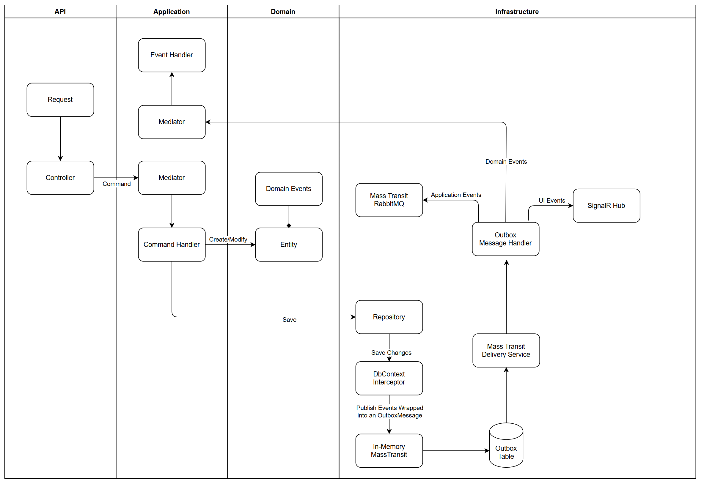

# ✉️ Outbox Pattern: Ensure Data Consistency with Messaging in .NET using MassTransit and Entity Framework Core 📬

Maintaining data consistency in distributed systems is one of the biggest challenges developers face. Imagine a typical scenario: you are building an API that creates new users, and in addition to saving the user data to the database, you need to send a verification email or trigger other external services. The problem arises when the database operation succeeds, but the notification fails due to a network issue or messaging system availability. In this case, you will have an inconsistent state, with the user created in the database but without the notification action having occurred.

The *Outbox Pattern* solves this problem by ensuring that database operations and messaging events are executed atomically and reliably.

---

### What is the Outbox Pattern?

The *Outbox Pattern* is a design pattern that helps ensure that database operations and event publishing are done atomically. It works by storing events in a dedicated table in the database (the outbox table) as part of the same transaction that handles the main data. Then, an asynchronous processor reads these events from the outbox table and publishes them to the messaging system (e.g., RabbitMQ).

The key to this pattern is that the persistence operation in the database and the storage of events in the outbox table are done in the same transaction, ensuring that both operations succeed or neither does. This avoids inconsistencies between the application state and the distributed events.

---

### Understanding MassTransit

MassTransit is a .NET library for message-based communication that facilitates asynchronous message integration with support for various transport providers, such as RabbitMQ, Azure Service Bus, Amazon SQS, among others. It provides robust abstractions for handling messages, queues, events, and integrations with Entity Framework Core, making it an ideal choice for applications that require reliable asynchronous communication.

### Native Outbox Functionality in MassTransit with EF Core

MassTransit provides native support for the Outbox Pattern in conjunction with Entity Framework Core. It allows messages to be managed and processed automatically, integrating with the EF Core transaction lifecycle.

Here’s how to configure this in a project:

```csharp
services.AddMassTransit(x =>
{
    x.AddConsumer<OutboxMessageWrapperConsumer>();
    x.AddEntityFrameworkOutbox<ApplicationDbContext>(cfg =>
    {
        cfg.UseSqlServer(); // Configuration for SQL Server
        cfg.UseBusOutbox(y =>
        {
            //y.DisableDeliveryService(); // Disable the delivery service if necessary
        });
    });

    // In-memory message configuration
    x.UsingInMemory((ctx, cfg) =>
    {
        cfg.ConfigureEndpoints(ctx);
        cfg.UseMessageRetry(retryCfg =>
        {
            retryCfg.Interval(5, TimeSpan.FromSeconds(5)); // Retry attempts
        });
    });
});
```

**Explanation**:
- **`AddEntityFrameworkOutbox`**: Configures the Outbox Pattern using EF Core. Messages are persisted in the outbox table and delivered securely.
- **`UseBusOutbox`**: Enables asynchronous message sending, ensuring the Outbox Pattern is processed correctly.
- **In-memory Messages**: A useful configuration for managing initial delivery and retry attempts.

---

### Example Project Explanation

The example project implements the Outbox Pattern within a Clean Architecture-based structure. For a deeper understanding of Clean Architecture, check out this [article](https://medium.com/stackademic/%EF%B8%8F-exploring-clean-architecture-a-practical-guide-1f4e358415d1).

#### Layer Structure

1. **API Layer**: Exposes endpoints and manages HTTP requests.
2. **Application Layer**: Orchestrates business logic. Here, we use *Command Handlers* to encapsulate operations. For example:
   ```csharp
   internal sealed class UpdateProductPriceCommandHandler(IProductRepository productRepository, IEventDispatcher eventDispatcher)
       : IRequestHandler<UpdateProductPriceCommand>
   {
       public async Task Handle(UpdateProductPriceCommand request, CancellationToken cancellationToken)
       {
           var product = await productRepository.GetById(request.Id, cancellationToken)
               ?? throw new ProductNotFoundException(request.Id);

           product.ChangePrice(request.Price);

           var applicationEvent = new ProductPriceUpdated(product.Id, product.Price);
           await eventDispatcher.Dispatch(applicationEvent, cancellationToken);

           await productRepository.Update(product, cancellationToken);
       }
   }
   ```
   - **Explanation**: The *Command Handler* updates the product price, triggers an application event (`ProductPriceUpdated` in the application layer), and persists the changes.

3. **Domain Layer**: Defines entities and domain events. A base entity like `Entity` manages in-memory domain events:
   ```csharp
   public abstract class Entity
   {
       private readonly List<IDomainEvent> _domainEvents = new();
       public IReadOnlyCollection<IDomainEvent> DomainEvents => _domainEvents.AsReadOnly();

       protected void AddDomainEvent(IDomainEvent domainEvent)
       {
           _domainEvents.Add(domainEvent);
       }

       public void ClearDomainEvents() => _domainEvents.Clear();
   }
   ```

   A concrete entity like `Product` inherits from `Entity` and can raise domain events:
   ```csharp
   public class Product(string name, decimal price) : AggregateRoot(Guid.NewGuid())
   {
       public string Name { get; private set; } = name;
       public decimal Price { get; private set; } = price;

       public void ChangePrice(decimal newPrice)
       {
           var oldPrice = Price;
           Price = newPrice;
           RaiseEvent(new ProductPriceChanged(Id, oldPrice, newPrice));
       }
   }
   ```

4. **Infrastructure Layer**: Implements persistence and messaging configurations. The `DomainEventsInterceptor` is a crucial component that intercepts persistence operations and publishes domain events:
   ```csharp
   public sealed class DomainEventsInterceptor : SaveChangesInterceptor
   {
       public override ValueTask<InterceptionResult<int>> SavingChangesAsync(
        DbContextEventData eventData,
        InterceptionResult<int> result,
        CancellationToken cancellationToken = default)
    {

        DbContext? dbContext = eventData.Context;

        if (dbContext is null)
        {
            return base.SavingChangesAsync(eventData, result, cancellationToken);
        }

        var events = dbContext.ChangeTracker
              .Entries<AggregateRoot>()
              .Select(x => x.Entity)
              .SelectMany(aggregateRoot =>
              {
                  var domainEvents = aggregateRoot.GetDomainEvents();

                  aggregateRoot.ClearDomainEvents();

                  return domainEvents;
              })
              .Select(x => new OutboxMessageWrapper
              {
                  Payload = JsonConvert.SerializeObject(x),
                  MessageType = x.GetType().AssemblyQualifiedName!,
              })
              .ToList();

        var bus = dbContext.GetService<IPublishEndpoint>();
        bus.PublishBatch(events, cancellationToken);

        return base.SavingChangesAsync(eventData, result, cancellationToken);
    }
   }
   ```

   - **Explanation**: The `DomainEventsInterceptor` intercepts EF Core save operations, identifies entities with in-memory domain events, and publishes these events using MassTransit.

---



The project diagram illustrates a comprehensive architectural flow to implement the Outbox Pattern, combining MassTransit, RabbitMQ, and Mediatr. The integration between the various layers ensures data consistency and efficient performance. Let's detail how each layer contributes to this flow:

#### API Layer:

- The initial request hits the *Controller*, which creates a *Command* corresponding to the desired action (such as creating or updating an entity) and sends it to the *Mediator*.

#### Application Layer:

- The *Mediator* receives the *Command* and forwards it to the appropriate *Command Handler*.
- The *Command Handler* executes the business logic, performing create or update operations on specific entities that may result in in-memory *Domain Events* generation.
- During execution, the *Command Handler* may generate *Application Events* to signal that something important has happened (e.g., a product price update).
  
#### Domain Layer:

- Domain entities generate and raise Domain Events as needed. These events are critical for triggering associated business operations, such as notifications or real-time updates.

#### Infrastructure Layer:

- The Repository persists the changes to the database.
- The *DomainEventsInterceptor* intercepts EF Core persistence operations, capturing *Domain Events*. It wraps them as Outbox messages and stores them in the Outbox Table in the same transaction.
- The primary instance of *MassTransit* is configured to use in-memory messages, as its role is to send messages persisted in the outbox table to the *OutboxMessageWrapperConsumer* through its internal delivery service running in the background.
  


### Processing by *OutboxMessageWrapperConsumer*:

- When a message is delivered to the *OutboxMessageWrapperConsumer*:
    - *Domain Events*: If the message represents a domain event, the *OutboxMessageWrapperConsumer* forwards the event back to the Mediator. This ensures domain event processing occurs in memory, enabling additional business actions without leaving the application.
    - Application Events: If the message is an application event (such as external notifications or updates), it is sent to another instance of MassTransit with RabbitMQ for delivery to other services.
    - UI Events: Events impacting the user interface are sent to the SignalR Hub for real-time communication, allowing instant updates to connected clients.

```csharp
internal class OutboxMessageWrapperConsumer : IConsumer<OutboxMessageWrapper>
{
    private readonly MediatR.IMediator _mediator;
    private readonly Bind<IExternalBus, IPublishEndpoint> _publishEndpoint;
    private readonly IHubContext<NotificationHub> _hubContext;
    private readonly ILogger<OutboxMessageWrapperConsumer> _logger;
    public OutboxMessageWrapperConsumer(
        MediatR.IMediator mediator,
        Bind<IExternalBus, IPublishEndpoint> publishEndpoint,
        IHubContext<NotificationHub> hubContext
        )
    {
        _mediator = mediator;
        _publishEndpoint = publishEndpoint;
        _hubContext = hubContext;
    }

    public async Task Consume(ConsumeContext<OutboxMessageWrapper> context)
    {
        await RouteEvent(context.Message);
    }

    private async Task RouteEvent(OutboxMessageWrapper eventMessage)
    {
        var messageType = Type.GetType(eventMessage.MessageType);
        var @event = JsonConvert.DeserializeObject(eventMessage.Payload, messageType!);

        try
        {
            switch (@event)
            {
                case IDomainEvent:
                    await _mediator.Publish(@event);
                    break;
                case IApplicationEvent:
                    await _publishEndpoint.Value.Publish(@event);
                    break;
                case IUiEvent:
                    await _hubContext.Clients.All.SendAsync("ReceiveMessage", @event);
                    break;
            }
        }
        catch (Exception ex)
        {
            _logger.LogError(ex, "Error while processing event");
        }
    }
}
```

#### Using MultiBus

The project uses **MassTransit's MultiBus** to separate message flows:
- **Default Instance**: Processes in-memory events and integrates the Outbox Pattern.
- **`IExternalBus` Instance**: Publishes application events externally via RabbitMQ. This approach isolates internal events from external ones, providing a more modular and flexible architecture.

**MultiBus Configuration**:
```csharp
services.AddMassTransit<IExternalBus>(x =>
{
    x.AddConsumers(typeof(ApplicationLayer.Extensions.ServiceCollectionExtensions).Assembly);
    x.UsingRabbitMq((context, cfg) =>
    {
        cfg.Host(configuration.GetSection("RabbitMq:Host").Value,
                 configuration.GetSection("RabbitMq:VirtualHost").Value, h =>
        {
            h.Username(configuration.GetSection("RabbitMq:Username").Value!);
            h.Password(configuration.GetSection("RabbitMq:Password").Value!);
        });

        cfg.ConfigureEndpoints(context);
    });
});
```

**Motivation for Using MultiBus**:
- **Flow Isolation**: Separates internal and external events, keeping the system more organized.
- **Independent Configurations**: Each bus can have its own setup, allowing communication policies to be optimized for different scenarios. For instance, internal events can be processed more simply and quickly, while external events, requiring more security and reliability, can use a more robust infrastructure like RabbitMQ or Amazon SQS.

---

The Outbox Pattern is a crucial strategy for maintaining data consistency in distributed systems, and its implementation in .NET is facilitated with MassTransit and EF Core. Clean Architecture keeps the project organized, modular, and easy to scale, while MassTransit's MultiBus provides flexibility for managing different message flows efficiently.

The example project illustrates how you can integrate these technologies to build a robust application. From persisting entities to safely publishing events, each architectural layer plays an essential role. The use of the DomainEventsInterceptor is critical to ensuring that domain events are correctly handled in memory before being published, avoiding inconsistencies.

If you want to apply this approach in your project or explore the code in detail, visit the OutboxPatternExample repository. For a deeper understanding of Clean Architecture, don't miss the linked article on the topic. And if you have questions or suggestions, feel free to contribute or comment on GitHub.

This architecture provides a solid foundation for modern distributed applications, ensuring data consistency, scalability, and simplified maintenance.
