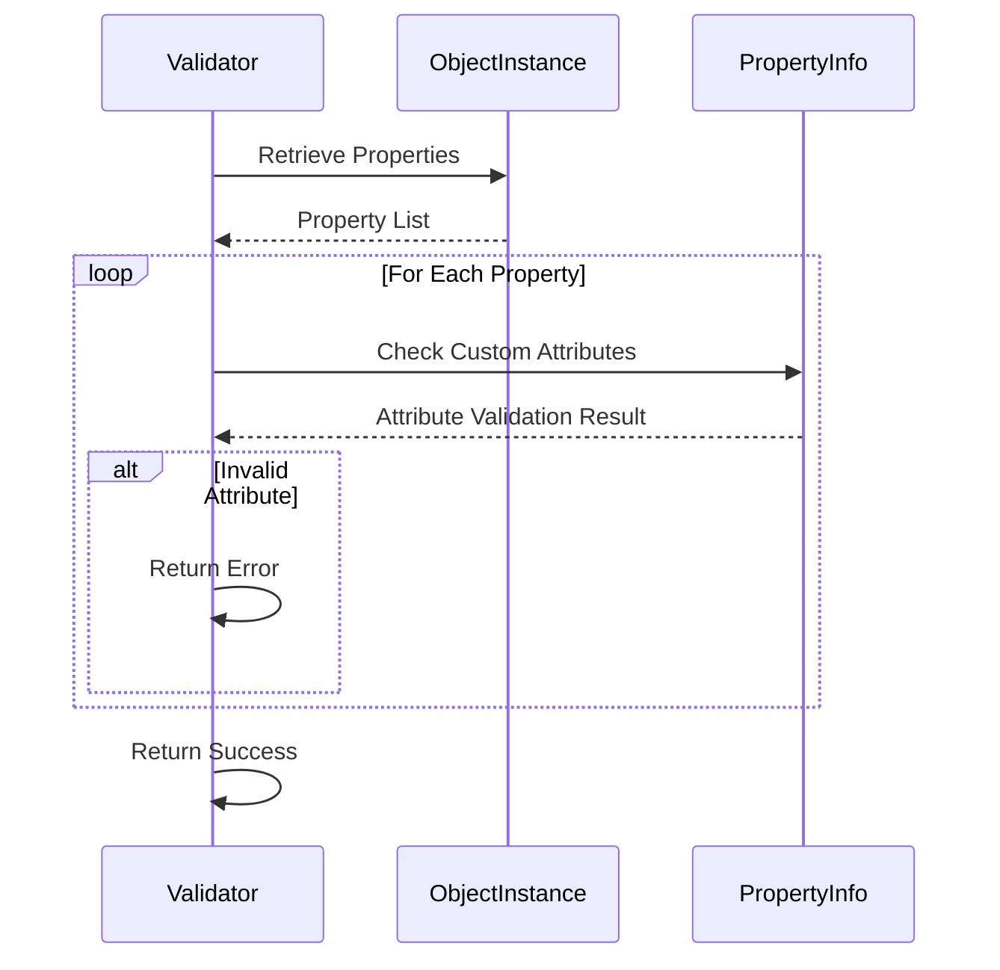
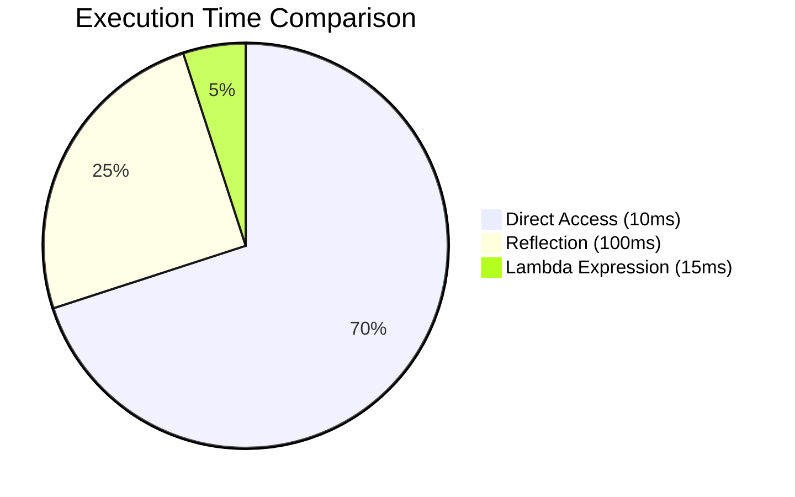

# 🪞 Practical Applications of Reflection in C# and Its Trade-Offs 🛠️

Reflection is a powerful tool in the arsenal of a .NET developer. It allows you to explore and manipulate the internal behavior of your code at runtime. However, like any powerful tool, Reflection should be used with care to avoid hidden costs in performance, maintainability, and security.

In this article, we will explore **practical applications of Reflection in C#**, complemented by examples and diagrams, and discuss the trade-offs involved to help you decide when and how to use it responsibly.

---

## What Is Reflection?

Reflection in C# is the act of inspecting and manipulating type metadata at runtime. With it, you can:

- Inspect types (`Type`), properties (`PropertyInfo`), and methods (`MethodInfo`).
- Dynamically create object instances.
- Invoke methods or access properties, even private ones.

Here is a basic example to obtain information about a type:

```csharp
var type = typeof(Person);
Console.WriteLine($"Type: {type.Name}");

foreach (var prop in type.GetProperties())
{
    Console.WriteLine($"Property: {prop.Name}, Type: {prop.PropertyType}");
}
```

Output for the `Person` class:

```plaintext
Type: Person
Property: Name, Type: System.String
Property: Age, Type: System.Int32
```

Reflection is often used to create dynamic solutions. Let’s explore some practical use cases.

---

## Practical Applications

### 1. Building Object Mappers

Reflection can be used to map properties between objects of different types. A typical case is transforming a DTO into a domain entity.

#### Example: Simple Mapper
```csharp
public static T Map<T>(object source) where T : new()
{
    var destination = new T();
    var sourceProps = source.GetType().GetProperties();
    var destProps = typeof(T).GetProperties();

    foreach (var sourceProp in sourceProps)
    {
        var destProp = destProps.FirstOrDefault(p => p.Name == sourceProp.Name && 
                                                     p.PropertyType == sourceProp.PropertyType);
        if (destProp != null && destProp.CanWrite)
        {
            destProp.SetValue(destination, sourceProp.GetValue(source));
        }
    }

    return destination;
}
```

Calling the function:
```csharp
var personDto = new { Name = "John", Age = 30 };
var person = Map<Person>(personDto);
```

---

### 2. Dynamic Plugin System

A plugin system allows you to load external functionalities without altering the base code. This can be achieved using Reflection to load assemblies and dynamically instantiate classes.

#### Plugin Loading Pipeline


#### Example Code
```csharp
var assembly = Assembly.LoadFrom("MyPlugin.dll");
var pluginType = assembly.GetTypes().FirstOrDefault(t => typeof(IPlugin).IsAssignableFrom(t));
if (pluginType != null)
{
    var plugin = (IPlugin)Activator.CreateInstance(pluginType);
    plugin.Execute();
}
```

---

### 3. Validation Using Custom Attributes

Custom attributes can be used to dynamically validate objects, with Reflection inspecting metadata and applying rules.

#### Validation Flow with Custom Attributes


#### Example: Property Validation
```csharp
[AttributeUsage(AttributeTargets.Property)]
public class RequiredAttribute : Attribute {}

public class User
{
    [Required]
    public string Name { get; set; }
}

public static bool Validate(object obj)
{
    var type = obj.GetType();
    foreach (var prop in type.GetProperties())
    {
        if (Attribute.IsDefined(prop, typeof(RequiredAttribute)) &&
            prop.GetValue(obj) == null)
        {
            return false;
        }
    }
    return true;
}
```

Calling the validation:
```csharp
var user = new User();
Console.WriteLine(Validate(user) ? "Valid" : "Invalid"); // Invalid
```

---

## Trade-Offs

### 1. Performance
Reflection is inherently slower because it involves searching and manipulating metadata at runtime. A simple benchmark can illustrate this:

```csharp
// Direct access
person.Name = "John";

// Reflection
var prop = typeof(Person).GetProperty("Name");
prop.SetValue(person, "John");
```

#### Execution Time Comparison



---

### 2. Maintainability
Code based on Reflection can be harder to debug and understand. For example, if a property name changes, the code may fail silently.

**Tip**: Encapsulate Reflection logic into reusable methods to reduce its impact.

---

### 3. Security
Reflection can expose private members, which might be exploited by malicious code. Always limit the use of Reflection to trusted contexts.

---

## When to Use Reflection

- **Recommended Scenarios**:
  - Plugin or extensibility systems.
  - Dynamic frameworks or libraries.
  - Advanced unit tests or mocks.

- **Scenarios to Avoid**:
  - Performance-critical code.
  - Scenarios where static behavior suffices.

---

## Conclusion

Reflection is a powerful tool, but with great power comes great responsibility. Knowing when to use it and how to mitigate its trade-offs is essential for creating clean, secure, and performant code. Try the examples in this article and explore new use cases in your projects, but always critically evaluate its impact.

If you have experiences or interesting cases with Reflection, share them in the comments. Let’s keep learning together! 🚀
