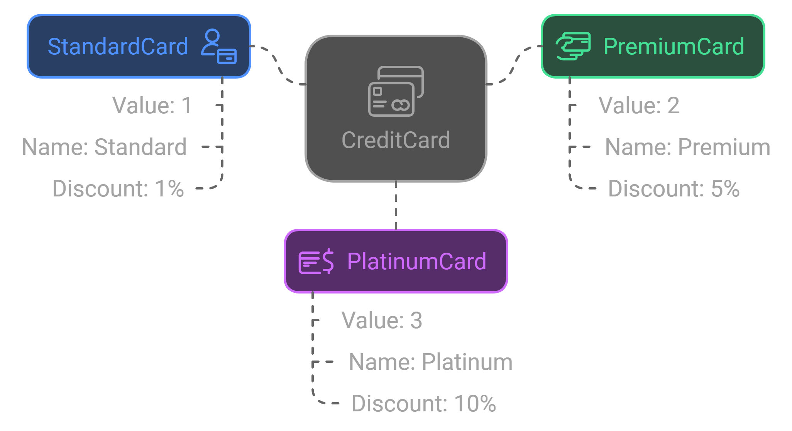

# 🔢 Strongly Typed Enum in C# - A Complete Guide 💪

Enums in C# are widely used to represent a set of constant values, but they have limitations, such as the inability to attach behaviors or additional data directly to those values. In this article, we'll address these limitations and, more importantly, create a strongly typed enum implementation that adds behavior and data to enum values.

## Limitations of Enums in C#

Let's start with a simple implementation of a credit card enum, where we have card types (Standard, Premium, Platinum) and a `switch` statement that returns a discount based on the card type. Below is a basic code structure that prints the card type and the discount:

```csharp
enum CreditCard
{
    Standard,
    Premium,
    Platinum
}

// Using switch to set a discount based on the card type
var cardType = CreditCard.Platinum;
double discount = cardType switch
{
    CreditCard.Standard => 0.01,
    CreditCard.Premium => 0.05,
    CreditCard.Platinum => 0.1,
    _ => 0
};

Console.WriteLine($"The discount for {cardType} is {discount * 100}%");
```

This approach works but comes with some issues:
1. **Maintenance**: Adding a new value to the enum requires updating the `switch` statement.
2. **Extensibility**: Traditional enums do not allow specific behaviors and data to be directly assigned to values.

To address this, let's implement a strongly typed enum.

## Building a Strongly Typed Enum

To begin, we will create an abstract class `Enumeration` that will serve as the base for our strongly typed enums. It will have two properties, `Value` and `Name`, which will be unique for each enum value. This pattern allows us to add specific behaviors and simplifies value handling.

### Structure of the `Enumeration` Class

The `Enumeration` class is generic and implements the `IEquatable` interface, which helps with instance comparison. Below is the initial structure:

```csharp
public abstract class Enumeration<TEnum> : IEquatable<Enumeration<TEnum>>
    where TEnum : Enumeration<TEnum>
{
    public int Value { get; }
    public string Name { get; }

    protected Enumeration(int value, string name)
    {
        Value = value;
        Name = name;
    }

    public bool Equals(Enumeration<TEnum>? other)
    {
        if (other == null) return false;
        return GetType().Equals(other.GetType()) && Value.Equals(other.Value);
    }

    public override bool Equals(object? obj)
    {
        return obj is Enumeration<TEnum> other && Equals(other);
    }

    public override int GetHashCode() => Value.GetHashCode();
}
```

Here, `Value` and `Name` are initialized only once, ensuring each enum value has a unique representation. We also implement the `Equals` and `GetHashCode` methods to enable comparisons.

### Static Methods for Value Retrieval

We will add methods to fetch specific enum instances based on `Value` or `Name`. We use dictionaries for quick value access and methods `CreateEnumerationsByValue` and `CreateEnumerationsByName` to initialize these dictionaries:

```csharp
private static readonly Dictionary<int, TEnum> EnumerationsByValue = CreateEnumerationsByValue();
private static readonly Dictionary<string, TEnum> EnumerationsByName = CreateEnumerationsByName();

public static TEnum? FromValue(int value)
{
    return EnumerationsByValue.TryGetValue(value, out var enumValue) ? enumValue : null;
}

public static TEnum? FromName(string name)
{
    return EnumerationsByName.TryGetValue(name, out var enumValue) ? enumValue : null;
}

private static Dictionary<int, TEnum> CreateEnumerationsByValue()
{
    return typeof(TEnum)
        .GetFields(System.Reflection.BindingFlags.Public | System.Reflection.BindingFlags.Static | System.Reflection.BindingFlags.DeclaredOnly)
        .Where(f => f.FieldType == typeof(TEnum))
        .Select(f => (TEnum)f.GetValue(null)!)
        .ToDictionary(e => e.Value);
}

private static Dictionary<string, TEnum> CreateEnumerationsByName()
{
    return typeof(TEnum)
        .GetFields(System.Reflection.BindingFlags.Public | System.Reflection.BindingFlags.Static | System.Reflection.BindingFlags.DeclaredOnly)
        .Where(f => f.FieldType == typeof(TEnum))
        .Select(f => (TEnum)f.GetValue(null)!)
        .ToDictionary(e => e.Name);
}
```

These methods use reflection to identify public and static fields that correspond to enum values, building the `EnumerationsByValue` and `EnumerationsByName` dictionaries.

### Example Usage with Credit Card

To illustrate the functionality, let's apply our `Enumeration` class by creating a `CreditCard` class. In this class, we define specific cards and their respective discounts.



```csharp
public abstract class CreditCard : Enumeration<CreditCard>
{
    public static readonly CreditCard Standard = new StandardCard();
    public static readonly CreditCard Premium = new PremiumCard();
    public static readonly CreditCard Platinum = new PlatinumCard();

    public abstract double Discount { get; }

    private CreditCard(int value, string name) : base(value, name) { }

    private sealed class StandardCard : CreditCard
    {
        public StandardCard() : base(1, "Standard") { }
        public override double Discount => 0.01;
    }

    private sealed class PremiumCard : CreditCard
    {
        public PremiumCard() : base(2, "Premium") { }
        public override double Discount => 0.05;
    }

    private sealed class PlatinumCard : CreditCard
    {
        public PlatinumCard() : base(3, "Platinum") { }
        public override double Discount => 0.1;
    }
}
```

Each inner class represents a specific card type with a specific discount. This design allows us to easily extend the class to add more card types with new values and behaviors.

### Helper Methods and Usage

To fetch a value based on external data (e.g., a value from an API), we use the `FromValue` or `FromName` methods.

```csharp
// Using FromValue to fetch a card by its value
var card = CreditCard.FromValue(1);
Console.WriteLine($"The discount for {card?.Name} is {card?.Discount * 100}%");

// Using FromName to fetch a card by its name
var platinumCard = CreditCard.FromName("Platinum");
Console.WriteLine($"The discount for {platinumCard?.Name} is {platinumCard?.Discount * 100}%");
```

This flexibility makes it easier to handle enum values without needing `switch` statements or additional manual checks.

## Conclusion

Implementing strongly typed enums in C# allows us to work with safer and more extensible types. By encapsulating specific behavior in each enum value, we reduce code complexity, improve readability, and increase safety, especially in scenarios that require frequent maintenance or value customization. This approach is useful for systems that need additional control and specific customizations on enum values, such as discount configurations for different card types.

This is just one example of how to create strongly typed enums. The same approach can be extended to add additional abstract methods implemented by each instance, providing even more flexibility and control.

[Source](https://www.youtube.com/watch?v=v6cYTcEfZ8A)
