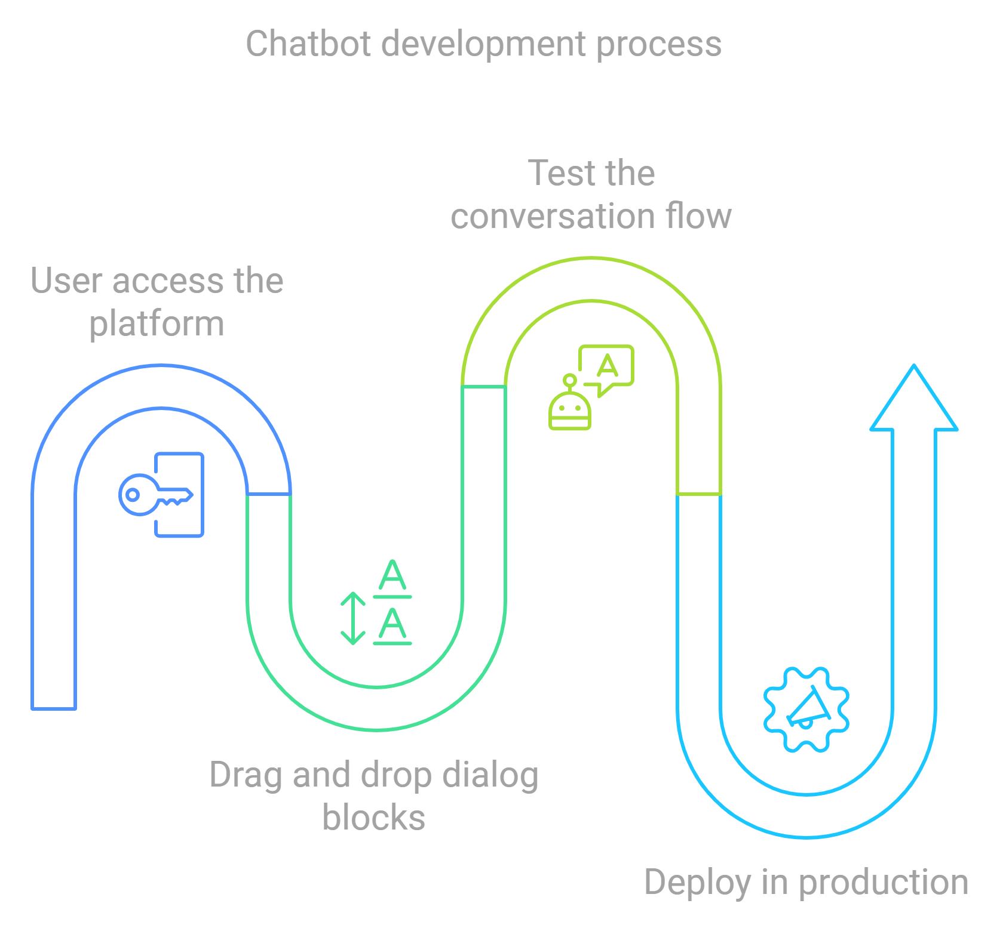

# 🤖 The Challenges of Creating a Web Platform for Building Chatbots 🧩

Creating a chatbot platform that balances simplicity with advanced capabilities is no easy feat. That's what I aimed to achieve with [Carubbi.ChatbotStudio](https://github.com/rcarubbi/Carubbi.ChatbotStudio), a web-based platform that lets users design conversational flows visually using **Blockly**. The interface makes chatbot development accessible to non-programmers while still offering powerful features for those who want to customize interactions and integrate various services. Here's a breakdown of how I brought this project to life, from conceptualization to implementation.

---

## 1. **The Vision Behind the Platform**

My goal for ChatbotStudio was clear: simplify chatbot creation without sacrificing flexibility. Key objectives included:

- **User-Friendly Visual Interface**: Users can build conversation flows by dragging and connecting visual blocks, making it easy for anyone to create complex dialogues.
- **Real-Time Testing**: A built-in testing environment to simulate conversations and adjust flows seamlessly.
- **Separate Environments for Development and Production**: To avoid impacting the live chatbot during updates and testing.



## 2. **Technology Stack**

Choosing the right tools was crucial. Here's what powers ChatbotStudio:

- **Backend**: Microsoft Bot Framework, written in C#.
- **Frontend**: Blockly for visual block-based programming, combined with React and HTML5.
- **Real-Time Testing Simulator**: An embedded chatbot web interface for testing and refining conversation flows.

### Why Blockly and the Microsoft Bot Framework?

- **Blockly**: It provided a robust foundation for creating the visual design experience, where users can intuitively build flows with blocks.
- **Microsoft Bot Framework**: A reliable and scalable backend for handling the logic and execution of chatbots.

---

## 3. **Implementing the Visual Interface with Blockly**

Setting up Blockly was a pivotal step in the project. The interface allows users to build chatbot logic by arranging blocks that represent different actions, such as asking a question or calling an external API.

### Key Features:

1. **Custom Blockly Blocks**: Each block represents a specific chatbot action, like sending a message, capturing input, or navigating to another step in the flow. 
   To create new custom blocks, you can use the Blockly [Developer Tools](https://blockly-demo.appspot.com/static/demos/blockfactory/index.html). This tool helps you generate the block definition code, as well as the toolbox and workspace configuration, making it much easier to integrate new blocks into your project.

   **Example** (from `customblocks.js`):
   ```javascript
   // Define a custom block for sending messages
   const jsonBotDefinitionBlocks = [
     {
       "type": "messagestep",
       "message0": "%1 Message %2", // Displayed text on the block
       "args0": [
         { "type": "field_label_serializable", "name": "Id", "text": "" }, // Label field
         { "type": "input_value", "name": "Messages", "check": "MessageInteractions" } // Input field for messages
       ],
       "previousStatement": null, // Indicates this block can connect to blocks above
       "nextStatement": null, // Indicates this block can connect to blocks below
       "colour": 90, // Color of the block
       "tooltip": "Message Step", // Tooltip for the block
       "helpUrl": "" // Help URL for additional information
     },
     // Additional block definitions...
   ];
   ```

2. **Flow Representation**: To make it easy for users to visualize the conversation’s structure, I implemented a dynamic flow chart using flowchart.js. This library generates flow charts from a simple script language. To bridge the gap between Blockly blocks and the flowchart, I developed a custom parser that converts the block structures into the script format required by flowchart.js. This integration provides users with an intuitive, visual overview of their conversation flows.

3. **Custom JSON Output**: A custom generator was developed to convert blocks into a structured JSON format that the backend can process.

   **Example** (from `codeGenerator.js`):
   ```javascript
   // Generator for converting the Blockly workspace into JSON
   const JsonBotDefinition = new Blockly.Generator('JsonBotDefinition');

   // Function to extract blocks from the workspace and convert to JSON
   JsonBotDefinition.fromWorkspace = (workspace) => {
       let top_blocks = workspace.getTopBlocks(false); // Get top-level blocks
       for (let block of top_blocks) {
           if (block.type === 'botconfig')
               return JsonBotDefinition.generalBlockToObj(block, workspace); // Convert block to JSON
       }
   };

   // Function to handle conversion of individual blocks
   JsonBotDefinition.generalBlockToObj = (block, workspace) => {
       if (block && !block.isShadow_) { // Ignore shadow blocks
           let func = JsonBotDefinition[block.type]; // Get the conversion function for the block type
           if (func) {
               return func.call(JsonBotDefinition, block, workspace); // Call the function to generate JSON
           } else {
               console.log("Unknown block type: " + block.type); // Log if block type is unknown
           }
       }
       return null; // Return null if block is not valid
   };
   ```

---

## 4. **Backend Integration: Making Conversations Work**

The backend, built with the Microsoft Bot Framework, interprets the JSON flow from the frontend and executes the chatbot’s logic. Here’s how it works:

- **Parsing JSON**: The backend translates JSON instructions into bot actions, such as displaying messages or handling user input.

### Example: Handling a Simple Message

**Example** (from `MessageDialog.cs`):
```csharp
// Perform the start action for the dialog
protected override async Task PerformStartAsync(IDialogContext context)
{
    // Create a message activity from the configured step details
    var message = await CreateActivityWithMessage(context, _step.Messages, string.Format(Constants.DEFAULT_MESSAGE, _step.Id));
    await context.PostAsync(message); // Send the message to the user

    // Check if there is a next step in the conversation flow
    if (_step.NextStepId.HasValue)
    {
        var nextStep = GetStep(_step.NextStepId.Value); // Retrieve the next step
        var dialog = nextStep.MakeDialog(_botConfig, context.Activity, _parentStep); // Create a dialog for the next step

        if (dialog != null)
        {
            context.Call(dialog, GoBack); // Continue the conversation with the next step
        }
        else
        {
            context.Done<object>(null); // End the conversation if no dialog is found
        }
    }
    else
    {
        context.Done<object>(null); // End the conversation if there is no next step
    }
}
```

---

## 5. **Handling Maps and Location Services**

The `MapsDialog.cs` file illustrates how the platform integrates with mapping services to provide location-based functionality.

**Example** (from `MapsDialog.cs`):
```csharp
// Perform the start action for the maps dialog
protected override async Task PerformStartAsync(IDialogContext context)
{
    var message = context.MakeMessage(); // Create a new message activity
    message.AttachmentLayout = AttachmentLayoutTypes.Carousel; // Set the layout for multiple attachments

    // Parse locations from the input and store them in the output
    var locations = (await ParseLocations(_step.Input)).ToList();
    _step.Output.Locations = locations;
    PersistOutput(context, _step.Output); // Save the output

    // Create hero cards for each location and add to the message
    var cards = CreateHeroCards(locations, 
        locations.Select(x => x.Name).ToArray(),
        _step.Selectable ? locations.Select(x => x.Id).ToArray() : null);

    foreach (var card in cards)
    {
        message.Attachments.Add(card.ToAttachment()); // Add each card as an attachment
    }

    await context.PostAsync(message); // Send the message to the user

    if (_step.Selectable)
        context.Wait(LocationSelectedAsync); // Wait for the user to select a location
    else
    {
        if (_step.NextStepId.HasValue)
        {
            var nextStep = GetStep(_step.NextStepId.Value); // Get the next step
            var dialog = nextStep.MakeDialog(_botConfig, context.Activity, _parentStep); // Create the next dialog
            context.Call(dialog, GoBack); // Continue the conversation
        }
        else
        {
            context.Done<object>(null); // End the conversation if there is no next step
        }
    }
}
```

---

## 6. **User Experience Enhancements: Intellisense and Real-Time Testing**

### Intellisense for Easy Configuration

To simplify the configuration of expressions, I implemented **Intellisense**. This feature not only suggests previously captured steps and values as users type but also includes an **Auto-Complete** system that dynamically suggests input values for specific fields, enhancing user experience and reducing errors.

**Example** (from `FieldAutoComplete.js`):
```javascript
// Custom auto-complete field for Blockly
export class FieldAutoComplete extends Blockly.FieldTextInput {
    // Debounce function to limit the rate of API calls
    debounce(func, timeout = 500) {
        return (...args) => {
            clearTimeout(this.timer);
            this.timer = setTimeout(() => { func.apply(this, args); }, timeout);
        };
    }

    // Fetch suggestions from the service URL
    async fetchSuggestions(term) {
        try {
            const response = await fetch(`${this.serviceUrl}${term}`);
            return response.status === 200 ? await response.json() : []; // Return suggestions if the response is successful
        } catch {
            return []; // Return an empty array if there is an error
        }
    }

    // Show the suggestions in a dropdown
    async showSuggestions(term) {
        const results = await this.fetchSuggestions(term); // Fetch suggestions
        if (results.length > 0) {
            const editor = this.dropdownCreate_(results); // Create the dropdown
            Blockly.DropDownDiv.getContentDiv().appendChild(editor); // Append the dropdown to the Blockly content
        }
    }
}
```

### Real-Time Testing and Flow Validation

A standout feature of the platform is the **real-time testing simulator**. The embedded webchat, which is the webchat interface provided by Microsoft, uses **DirectLine** to interact with the Microsoft Bot Framework. This integration ensures that the chatbot can be tested in a live environment, making adjustments on the fly. The simulator allows developers to verify the behavior of the bot and ensures everything works smoothly before going live.

---

## 7. **Managing Development and Production Environments**

The platform manages development and production environments in a structured way:

- **API Instances**: Two separate instances of the API are available: one for **staging** and one for **live production**.
- **Publishing Workflow**: When a user is satisfied with a conversation flow, they can publish the flow to the live environment using the platform’s UI.
- **Version Management**:
  - If any modifications are made after a flow is published, a new version of the flow is automatically created.
  - This new version is deployed to the **staging environment** for testing and verification.
- **Seamless Updates**: This setup ensures that all changes are properly tested before being promoted to the live environment, offering a safe and efficient release process.

---

## 🚀 **Get Involved!**

ChatbotStudio is open-source and ready for collaboration. Check it out on [GitHub](https://github.com/rcarubbi/Carubbi.ChatbotStudio) to explore the code, contribute, or adapt it for your own projects. For a closer look, watch the demo on YouTube: [Watch Here](https://www.youtube.com/watch?v=Ri5ABGHxGq0).
To see the tool in action, you can also watch these short demo clips in pt-br below:

https://user-images.githubusercontent.com/1128724/168243164-812d8af8-a24b-4f11-a46c-f85d82017d64.mp4

https://user-images.githubusercontent.com/1128724/168454581-0590a0ca-59f2-4098-9299-c5a4563bde78.mp4

I’d love to hear your feedback or suggestions for future enhancements! Let’s push the boundaries of chatbot development together. 

---
