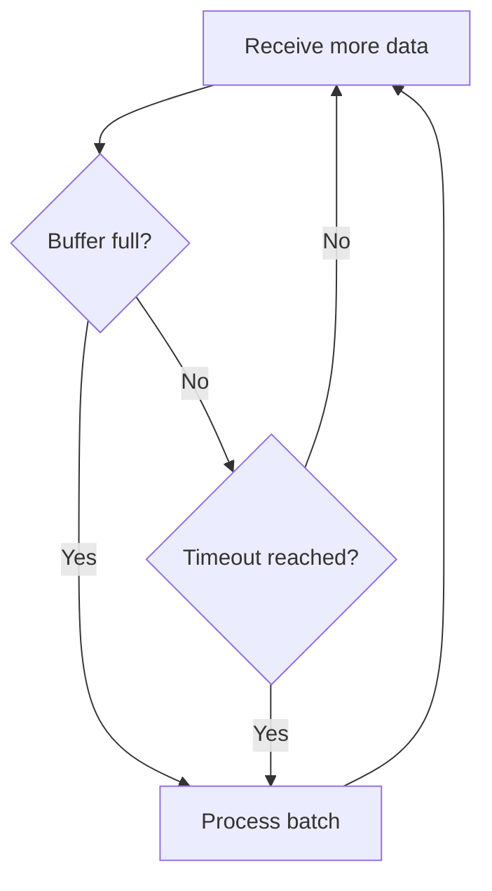
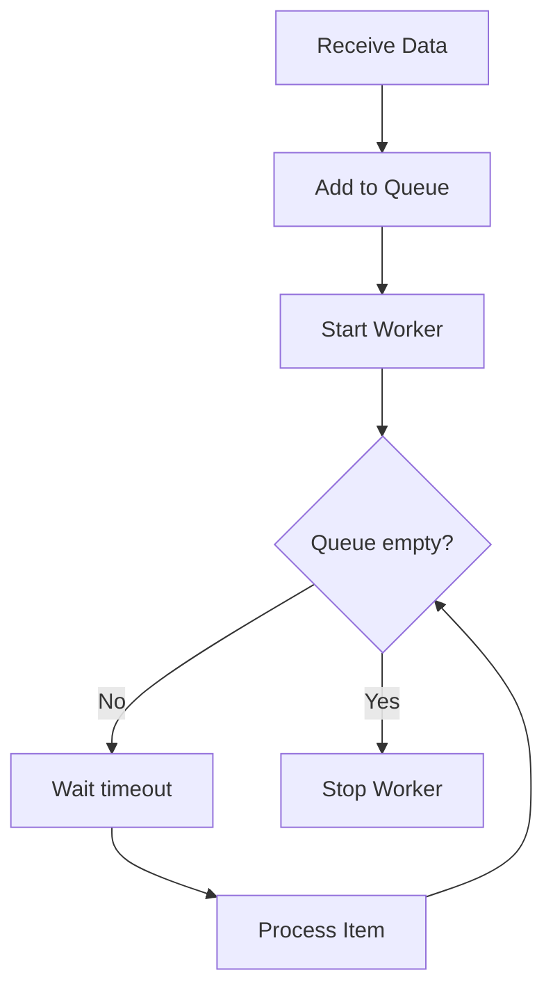
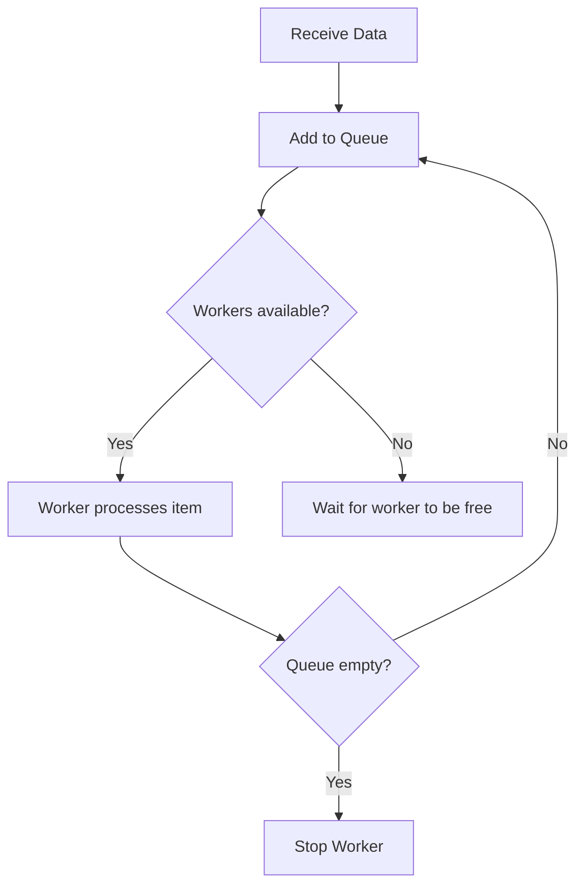

# 📥 Unveiling Data Sinks: Enhance Data Processing with Examples in .NET 💾

In software systems, the term **data sink** refers to a destination point where data is sent for processing, storage, or analysis. It is often used in data pipelines, streaming architectures, or event-based systems to manage how and when data is consumed. This article explores the concept of a **data sink**, presents various implementations in .NET, and discusses use cases for each approach.

> **Complete Source Code**: All the implementations described in this article are available in the GitHub repository: [Carubbi.DataSinks](https://github.com/rcarubbi/Carubbi.datasinks).

---

## What is a Data Sink?

A **Data Sink** is a destination where data is sent for processing, storage, or analysis. It can be configured to:

- Process data in **batches**.
- Delay processing to optimize resource usage.
- Operate in real time, using buffers and workers to handle high concurrency.
- **Dynamically scale**, adjusting the number of workers according to demand.

---

## Data Sink Implementations in .NET

In this article, we present four main implementations, each designed for specific scenarios.

---

### **1. Data Sink with Size and Time Limits**

This data sink processes accumulated data in **batches**. It triggers processing when:
- The number of items in the buffer reaches a predefined limit (e.g., 100 items).
- A time interval is reached (e.g., every 10 seconds), regardless of the number of items in the buffer.

#### **Benefits:**
- Ideal for scenarios where **resource optimization** is critical, such as sending data batches to APIs or saving records in databases.

#### **Code Example:**

```csharp
var batchingSink = new BatchingDataSink<string>(
    batchSize: 10,
    timeLimit: TimeSpan.FromSeconds(5),
    processBatch: async batch =>
    {
        Console.WriteLine($"Processing batch: {string.Join(", ", batch)}");
        await Task.Delay(100); // Simulates processing
    });

await batchingSink.ProcessAsync("Item1");
await batchingSink.ProcessAsync("Item2");
// Add more items...
await batchingSink.CompleteAsync();
```

#### **Diagram:**



#### **Use Cases:**
- Exporting logs in batches to systems like Elasticsearch.
- Sending metrics to a monitoring endpoint.

---

### **2. Data Sink with Delayed Processing**

This data sink delays processing of each item for a specified period. It uses a queue to store items and processes them in the background.

#### **Benefits:**
- Useful for scenarios where **processing time must be controlled**, such as debouncing in event systems.

#### **Code Example:**

```csharp
var delayedSink = new DelayedDataSink<string>(
    delay: TimeSpan.FromSeconds(3),
    process: async item =>
    {
        Console.WriteLine($"Processed after delay: {item}");
        await Task.Delay(100); // Simulates processing
    });

await delayedSink.ProcessAsync("ItemA");
await delayedSink.ProcessAsync("ItemB");
await delayedSink.CompleteAsync();
```

#### **Diagram:**



#### **Use Cases:**
- Notification systems that queue messages before sending.
- Debouncing actions in graphical interfaces or event systems.

---

### **3. Data Sink with Buffer and Worker Control**

This data sink uses a **buffer** and a configurable number of **workers** to process data as it arrives. If all workers are busy, the data is queued until a worker becomes available.

#### **Benefits:**
- Ideal for **high concurrency** scenarios where multiple items need to be processed simultaneously.

#### **Code Example:**

```csharp
var bufferedSink = new BufferedDataSink<string>(
    maxWorkers: 3,
    process: async item =>
    {
        Console.WriteLine($"Processed by worker: {item}");
        await Task.Delay(300); // Simulates processing
    });

await bufferedSink.ProcessAsync("Task1");
await bufferedSink.ProcessAsync("Task2");
await bufferedSink.CompleteAsync();
```

#### **Diagram:**



---

### **4. Elastic Worker Data Sink**

The **Elastic Worker Data Sink** takes concurrency to the next level, dynamically scaling the number of workers based on the queue size and a configurable scaling factor. It is ideal for scenarios where workload fluctuates significantly.

#### **Code Example:**

```csharp
var elasticSink = new ElasticWorkerDataSink<string>(
    minWorkers: 2,
    maxWorkers: 10,
    scalingFactor: 4, // Adjusts workers when the queue size is 4x or 1/4 of the current workers
    process: async item =>
    {
        Console.WriteLine($"Processing {item} by worker {Task.CurrentId}");
        await Task.Delay(200); // Simulates processing
    });

// Adding items to the sink
await elasticSink.ProcessAsync("Item1");
await elasticSink.ProcessAsync("Item2");

// Finalizing the sink
await elasticSink.CompleteAsync();
```

---

## Benefits of the Elastic Worker Data Sink

1. **Automatic Scalability**: The number of workers increases or decreases dynamically based on the queue size.
2. **Resource Optimization**: Reduces resource consumption during low-load periods.
3. **Flexible Configuration**: Allows adjustments for minimum and maximum limits and the scaling factor to fit various scenarios.

---

## **How to Choose the Right Data Sink?**

The choice of data sink depends on your scenario:

- **BatchingDataSink**:
  - Use when efficiency and data aggregation are important.
  - Example: Saving logs or metrics in batches.

- **DelayedDataSink**:
  - Use when processing needs to be delayed to avoid overload or react to events with controlled delay.
  - Example: Notifications or event debouncing.

- **BufferedDataSink or ElasticWorkerDataSink**:
  - Use for high concurrency scenarios where multiple processes must be managed simultaneously.
  - Example: Processing messages from distributed queues.

---

## **Best Practices for Implementing Data Sinks in .NET**

1. **Use Thread-Safe Structures:**
   - `ConcurrentQueue` to manage queues safely in multi-threaded environments.
2. **Concurrency Control:**
   - Use `SemaphoreSlim` to manage workers and avoid race conditions.
3. **Asynchronous Design:**
   - Ensure methods do not block threads by using `Task` and `Task.Delay`.
4. **Lifecycle Management:**
   - Always provide methods like `CompleteAsync` to ensure all processing is completed before shutting down the program.

---

## **Conclusion**

Data sinks are essential components for managing data flow in modern systems. This article presented three .NET implementations, each tailored to specific applications, such as batch processing, controlled delays, and high concurrency.

> **Complete Code**: All implementations are available in the GitHub repository: [Carubbi.DataSinks](https://github.com/rcarubbi/Carubbi.datasinks).

The flexibility of .NET enables the creation of robust and reusable implementations, making data sinks ideal for various architectures. Try out the approaches presented and adapt them to your needs. 🚀

If you enjoyed the content or have questions, leave a comment!
