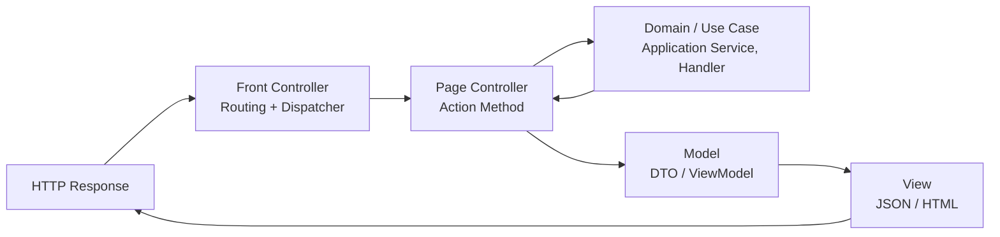

Depois de percorrer os padrões ligados ao **coração do domínio** e à **persistência de dados**, chegamos agora à camada mais visível de qualquer aplicação: a **apresentação**. É aqui que usuários, sistemas externos e integrações tocam o nosso software pela primeira vez. E, embora pareça apenas uma questão de “UI” ou “framework web”, a forma como estruturamos essa porta de entrada pode fortalecer, ou corroer, toda a arquitetura.

Martin Fowler dedicou uma parte importante do seu catálogo de _Patterns of Enterprise Application Architecture_ a esse tema. Ele descreveu como padrões como **MVC**, **Front Controller**, **Template View** e **Page Controller** organizam a interação inicial com o sistema. São soluções para problemas recorrentes: evitar duplicação de lógica de roteamento, separar responsabilidades de renderização, manter consistência no fluxo de requisições.

Eric Evans, em _Domain-Driven Design_, lembra que o papel da camada de apresentação é **traduzir intenções**. Ela deve transformar cliques, mensagens ou chamadas HTTP em comandos compreensíveis para o domínio, preservando a **Linguagem Ubíqua**. O usuário nunca deveria sentir que está falando com tabelas ou APIs, mas sim com conceitos do negócio.

Já Robert C. Martin, em _Clean Architecture_, é incisivo: a web, o framework e a interface são apenas detalhes. Controllers, views ou middlewares não podem ditar a forma do modelo. A arquitetura deve gritar casos de uso, e não endpoints ou verbos HTTP.

Nesta terceira parte da série, exploraremos esses padrões de entrada e integração com o mesmo olhar triplo: Fowler com seu catálogo pragmático, Evans com a defesa do domínio como centro, e Uncle Bob com a disciplina que protege esse centro contra a pressão das bordas.

---

### Índice da Série

#### Parte 1 – A lógica do domínio

- **[1.1 Transaction Script: do procedural ao domínio rico](https://www.tabnews.com.br/carubbi/tres-olhares-sobre-arquitetura-de-software-fowler-evans-e-uncle-bob-1-1-transaction-script-entre-proceduralismo-dominio-rico-e-arquitetura-limpa)**
- **[1.2 Table Module: tabelas falam mais alto que objetos?](https://www.tabnews.com.br/carubbi/tres-olhares-sobre-arquitetura-de-software-fowler-evans-e-uncle-bob-1-2-table-module-tabelas-falam-mais-alto-que-objetos)**
- **[1.3 Domain Model: o coração da arquitetura em três vozes](https://www.tabnews.com.br/carubbi/tres-olhares-sobre-arquitetura-de-software-fowler-evans-e-uncle-bob-1-3-domain-model-o-coracao-da-arquitetura-em-tres-vozes)**
- **[1.4 Service Layer: orquestrando casos de uso](https://www.tabnews.com.br/carubbi/tres-olhares-sobre-arquitetura-de-software-fowler-evans-e-uncle-bob-1-4-service-layer-orquestrando-casos-de-uso)**

#### Parte 2 – Persistência e Infraestrutura

- **[2.1 Active Record: simplicidade que pode custar caro](https://www.tabnews.com.br/carubbi/tres-olhares-sobre-arquitetura-de-software-fowler-evans-e-uncle-bob-2-1-active-record-simplicidade-que-pode-custar-caro)**
- **[2.2 Data Mapper: separando domínio e banco de dados](https://www.tabnews.com.br/carubbi/tres-olhares-sobre-arquitetura-de-software-fowler-evans-e-uncle-bob-2-2-data-mapper-separando-dominio-e-banco-de-dados)**
- **[2.3 Unit of Work: coordenando mudanças no domínio](https://www.tabnews.com.br/carubbi/tres-olhares-sobre-arquitetura-de-software-fowler-evans-e-uncle-bob-2-3-unit-of-work-coordenando-mudancas-no-dominio)**
- **[2.4 Identity Map & Lazy Load: truques de performance e consistência](https://www.tabnews.com.br/carubbi/tres-olhares-sobre-arquitetura-de-software-fowler-evans-e-uncle-bob-2-4-identity-map-e-lazy-load-truques-de-performance-e-consistencia)**

#### Parte 3 – Apresentação e Integração

- **[3.1 MVC e Front Controller: a porta de entrada](https://www.tabnews.com.br/carubbi/tres-olhares-sobre-arquitetura-de-software-fowler-evans-e-uncle-bob-3-1-mvc-e-front-controller-a-porta-de-entrada)**
- **[3.2 Template View e Page Controller: quando a UI dita o jogo](https://www.tabnews.com.br/carubbi/tres-olhares-sobre-arquitetura-de-software-fowler-evans-e-uncle-bob-3-2-template-view-e-page-controller-quando-a-ui-dita-o-jogo)**
- **3.3 Gateways e Mappers: defendendo o domínio**
- **3.4 Mensageria e integração: eventos em três perspectivas**

---

# Template View e Page Controller: quando a UI dita o jogo

## Template View na prática

Ao falar de apresentação, não basta pensar em como a requisição entra. Também precisamos refletir sobre como a resposta é produzida. Martin Fowler descreveu o padrão **Template View** como a solução para separar a lógica de renderização do código da aplicação. A ideia é simples: ter um arquivo de template que define a estrutura da saída (HTML, JSON, XML) e deixar que o código apenas injete os dados. Assim, evitamos misturar regras de negócio com marcação de tela ou serialização.

No ASP.NET Core, um exemplo clássico é o uso de **Razor Views**. O código C# prepara um ViewModel, e a página Razor decide como exibir esse conteúdo. Em APIs, o mesmo princípio aparece quando retornamos objetos que são serializados em JSON. O template aqui não é um arquivo Razor, mas o **serializador JSON**, que se comporta como uma “view engine”.

```csharp
// Exemplo com Razor View
public class OrdersController(IOrderQueryService orderQueryService) : Controller
{
    [HttpGet("/orders/{id}")]
    public IActionResult Details(Guid id)
    {
        var order = orderQueryService.GetById(id);
        var viewModel = new OrderDetailsViewModel(order.Id, order.CustomerName, order.Total);
        return View(viewModel); // Template View (Razor)
    }
}

public record OrderDetailsViewModel(Guid Id, string Customer, decimal Total);
```

```csharp
// Exemplo com API JSON
[HttpGet("/orders/{id}")]
public IActionResult GetOrder(Guid id)
{
    var order = orderQueryService.GetById(id);
    var dto = new OrderDto(order.Id, order.CustomerName, order.Total);
    return Ok(dto); // Template View = serialização JSON
}
```

Eric Evans, em _Domain-Driven Design_, lembra que a geração da view pertence ao mundo da **infraestrutura**. O domínio não deve saber nada sobre Razor, JSON ou HTML. Ele só precisa expor informações de forma coerente, para que a camada de apresentação as traduza. Robert C. Martin vai ainda mais longe em _Clean Architecture_: a UI é um detalhe. A mesma lógica de negócio deve sobreviver se amanhã trocarmos Razor por Blazor, ou JSON por gRPC.

---

## Page Controller explicado

Aqui surge uma das maiores confusões: se já temos o “C” do MVC, por que Fowler catalogou o **Page Controller** como um padrão separado? A resposta está no contexto. Quando ele publicou seu catálogo, muitos sistemas web não usavam MVC como conhecemos hoje. Alguns tinham um **Front Controller** genérico que despachava requests, outros tinham scripts ou classes independentes por página. Fowler percebeu que havia um padrão recorrente: **para cada página (ou endpoint), existia um controlador dedicado, com a responsabilidade de tratar aquele request específico**. Esse é o Page Controller.

No ASP.NET Core moderno, cada **action** de um controller é, na prática, um **Page Controller**. Por exemplo:

```csharp
public class OrdersController(IPlaceOrderCommnandHandler handler, IOrderQueryService orderQueryService) : Controller
{
    [HttpPost("/orders")]
    public IActionResult PlaceOrder(PlaceOrderRequest request)
    {
        var command = new PlaceOrderCommand(request.CustomerId, request.Items);
        var result = handler.Handle(command);

        if (!result.Success)
            return BadRequest(result.Errors);

        return Ok(new PlaceOrderResponse(result.OrderId));
    }

    [HttpGet("/orders/{id}")]
    public IActionResult GetOrder(Guid id)
    {
        var order = orderQueryService.GetById(id);
        return Ok(new OrderDto(order.Id, order.CustomerName, order.Total));
    }

}
```

Aqui temos dois **Page Controllers**: `PlaceOrder` e `GetOrder`. Cada um é responsável por uma rota específica, adapta o request para um comando ou consulta, chama a lógica apropriada e retorna a resposta.

---

## Relação entre MVC, Page Controller e Front Controller

É importante não confundir os três padrões. Eles atuam em camadas diferentes, mas se complementam. O **Front Controller** já está embutido no ASP.NET Core: é o pipeline central (roteamento, middlewares, dispatcher) que recebe todas as requisições e as encaminha para a action correta. O **Page Controller** são as actions que escrevemos; cada rota/página tem seu controlador dedicado. O **MVC** é a arquitetura de separação de responsabilidades: o Page Controller desempenha o papel de “C”, os DTOs/ViewModels são o “M” da apresentação, e a resposta (HTML/JSON) é a “V”.



Fowler catalogou os três como padrões distintos porque, na época, era comum encontrar sistemas que implementavam apenas um deles. Hoje, em frameworks maduros, os três estão presentes ao mesmo tempo. Eric Evans reforça que todos pertencem à infraestrutura: são adaptadores que convertem intenções do usuário em comandos para o domínio. Uncle Bob ecoa esse ponto ao afirmar que a UI é detalhe, e que a disciplina arquitetural exige manter casos de uso e entidades livres desses padrões.

---

## Conclusão

O **Template View** organiza a saída, separando marcação de dados. O **Page Controller** organiza a entrada, garantindo que cada rota tenha um controlador próprio. E o **MVC** é o guarda-chuva que junta Model, View e Controller para estruturar a apresentação. No ASP.NET Core moderno, os três aparecem juntos: o framework cuida do Front Controller, nós implementamos os Page Controllers (actions) e seguimos a arquitetura MVC na camada de borda.

Fowler nos mostrou como estruturar, Evans nos alertou que tudo isso é infraestrutura, e Uncle Bob nos lembrou que o domínio deve gritar casos de uso, não verbos HTTP nem templates. No próximo artigo, exploraremos **Gateways e Mappers**, entendendo como defender o domínio das pressões externas sem perder a clareza da linguagem ubíqua.
