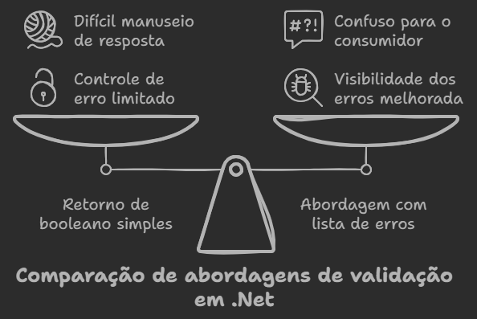
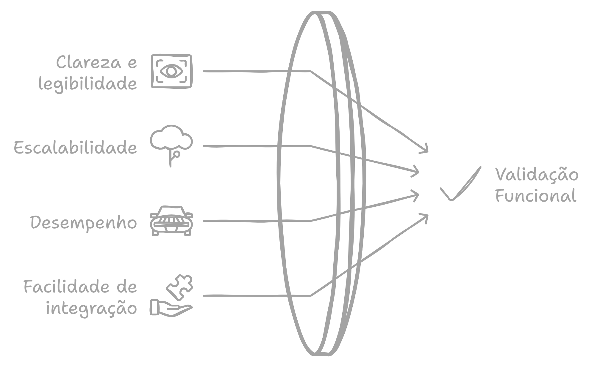

# 📜 Além do Básico: Como Usar LanguageExt e Specification Pattern para Validar em .NET 📦

Neste artigo, vamos explorar uma abordagem para validação em .NET utilizando a biblioteca LanguageExt e o **Specification Pattern** para melhorar a legibilidade e a manutenção do código. No mundo .NET, a validação é feita de várias maneiras, mas muitas práticas comuns trazem limitações que impactam a escalabilidade e o desempenho do código. Aqui, vamos analisar essas práticas e construir uma solução mais limpa e funcional.

## Problemas com as Abordagens Comuns de Validação

Frequentemente, vemos código de validação estruturado da seguinte forma:

<p align="center">
  
</p>

### 1. Abordagem Simples com Retorno de Booleano
Muitas vezes, métodos de validação retornam apenas `true` ou `false`, indicando se o objeto é válido. Isso, no entanto, limita o controle sobre os erros específicos e dificulta o manuseio detalhado de respostas de validação.
   
### 2. Abordagem de Lista de Erros (IEnumerable de Strings)
Outra prática comum é acumular erros em uma lista de strings, retornando essa lista ao final da validação. Isso melhora a visibilidade dos erros, mas pode ser confuso, pois requer que o consumidor do código interprete o significado de uma lista vazia como uma validação bem-sucedida. Além disso, essa abordagem carece de clareza em relação ao tipo e à natureza dos erros.

Ambas as abordagens sofrem com problemas de escalabilidade e complexidade, especialmente em cenários onde validações específicas podem ser aplicadas dinamicamente.

## Uma Solução Funcional com LanguageExt e o Specification Pattern

A biblioteca **LanguageExt** oferece um conjunto poderoso de ferramentas funcionais em .NET. Utilizando **monads**, como o `Either` e o `Validation`, podemos estruturar validações de maneira mais clara e modular. Combinando o Specification Pattern, que permite a criação de regras reutilizáveis, conseguimos alcançar uma solução limpa e extensível.

### 1. Estruturando Validações com o Specification Pattern

O **Specification Pattern** é ideal para situações onde as regras de validação variam e podem ser combinadas. Vamos definir uma interface `ISpecification` com um método `IsSatisfiedBy`, que recebe um objeto e retorna `true` ou `false`, e um `ErrorMessage`, que armazena a mensagem de erro:

```csharp
public interface ISpecification<T>
{
    bool IsSatisfiedBy(T entity);
    string ErrorMessage { get; }
}
```

Em seguida, podemos implementar especificações como `EmailSpecification`, `AgeSpecification`, entre outras:

```csharp
public class EmailSpecification : ISpecification<User>
{
    public bool IsSatisfiedBy(User user) =>
        !string.IsNullOrEmpty(user.Email) && user.Email.Contains("@");

    public string ErrorMessage => "Email inválido.";
}

public class AgeSpecification : ISpecification<User>
{
    public bool IsSatisfiedBy(User user) =>
        user.Age >= 18 && user.Age <= 120;

    public string ErrorMessage => "A idade deve estar entre 18 e 120.";
}
```

#### 2. Combinando Especificações e Usando LanguageExt para Retorno de Erros

Com as especificações em vigor, podemos criar um método de validação que utiliza `Validation<Error, T>`, onde `Error` representa a coleção de erros acumulados e `T` é o tipo a ser validado. Em LanguageExt, o tipo `Validation` permite que múltiplas validações falhem simultaneamente, acumulando erros.

Primeiro, vamos definir o tipo `ValidationError` para encapsular as mensagens de erro:

```csharp
public record ValidationError(string Message);
```

Em seguida, criamos um método que executa cada especificação e acumula erros usando `Validation<ValidationError, User>`:

```csharp
public static Validation<ValidationError, User> ValidateUser(User user)
{
    var specifications = new List<ISpecification<User>>
    {
        new EmailSpecification(),
        new AgeSpecification()
    };

    var errors = specifications
        .Where(spec => !spec.IsSatisfiedBy(user))
        .Select(spec => new ValidationError(spec.ErrorMessage))
        .ToSeq();

    return errors.Any() ? Validation<ValidationError, User>.Fail(errors) : Validation<ValidationError, User>.Success(user);
}
```

Neste exemplo, se algum erro for encontrado, a validação retorna uma lista de `ValidationError`. Caso contrário, retorna o próprio objeto `User`, indicando que ele passou nas verificações.

#### 3. Integrando com Respostas de API

Para um cenário de API, o uso de `Validation` permite mapear automaticamente o resultado em um `IResult` do .NET, facilitando o retorno de uma resposta apropriada:

```csharp
public static IResult ValidateAndRespond(User user)
{
    var validationResult = ValidateUser(user);

    return validationResult.Match(
        success => Results.Ok(success),
        errors => Results.BadRequest(errors.Select(e => e.Message))
    );
}
```

Aqui, a função `Match` verifica se a validação foi bem-sucedida ou não. Em caso de sucesso, retornamos `200 OK` com o objeto `User`; caso contrário, retornamos `400 Bad Request` com as mensagens de erro.

### 4. Benefícios da Abordagem Funcional com LanguageExt

- **Clareza e Leitura**: A estrutura funcional do código e o uso de `Validation` tornam o fluxo de validação intuitivo, sem necessidade de listas mutáveis.
- **Escalabilidade**: O Specification Pattern permite adicionar e combinar regras de validação facilmente.
- **Desempenho**: O código evita validações desnecessárias por meio de short-circuiting e não precisa alocar listas adicionais.
- **Facilidade de Integração**: O resultado de `Validation` pode ser facilmente mapeado para respostas HTTP em APIs.

<p align="center">
  
</p>

## Conclusão

Essa combinação de LanguageExt com o Specification Pattern traz uma abordagem de validação modular e funcional, que facilita o manuseio de erros e melhora a escalabilidade. Além de organizar o código, esse método permite controlar a execução das regras de validação de maneira robusta e adaptável, favorecendo o desenvolvimento de aplicações mais seguras e de fácil manutenção em .NET.

Essa técnica pode ser estendida para diversos cenários onde validações complexas e múltiplas condições precisam ser gerenciadas. Para quem deseja explorar o potencial do LanguageExt e das técnicas funcionais em C#, essa é uma solução excelente para começar.