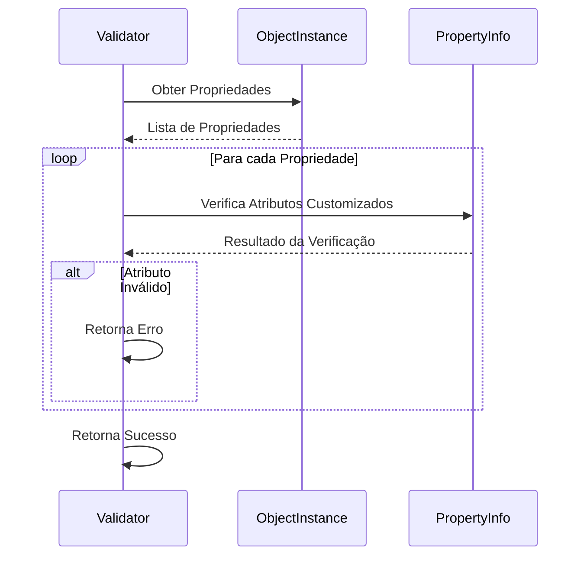

# 🪞 Aplicações Práticas de Reflection em C# e Seus Trade-Offs 🛠️

Reflection é uma ferramenta poderosa no arsenal de um desenvolvedor .NET. Ela permite que você explore e manipule o comportamento interno de seu código em tempo de execução. No entanto, como qualquer ferramenta poderosa, Reflection deve ser usada com cuidado para evitar custos ocultos de performance, manutenibilidade e segurança.

Neste artigo, exploraremos **aplicações práticas do uso de Reflection em C#**, complementadas por exemplos e diagramas, e discutiremos os trade-offs envolvidos para ajudá-lo a decidir quando e como usá-la de maneira responsável.

---

## O Que é Reflection?

Reflection em C# é o ato de inspecionar e manipular metadados de tipos em tempo de execução. Com ela, você pode:

- Inspecionar tipos (`Type`), propriedades (`PropertyInfo`), métodos (`MethodInfo`).
- Criar instâncias de objetos dinamicamente.
- Invocar métodos ou acessar propriedades, mesmo que sejam privadas.

Aqui está um exemplo básico para obter informações sobre um tipo:

```csharp
var type = typeof(Person);
Console.WriteLine($"Type: {type.Name}");

foreach (var prop in type.GetProperties())
{
    Console.WriteLine($"Property: {prop.Name}, Type: {prop.PropertyType}");
}
```

Saída para a classe `Person`:

```plaintext
Type: Person
Property: Name, Type: System.String
Property: Age, Type: System.Int32
```

Reflection é frequentemente utilizada para criar soluções dinâmicas. Vamos explorar alguns casos práticos.

---

## Aplicações Práticas

### 1. Construção de Mapeadores de Objetos
Reflection pode ser usada para mapear propriedades entre objetos de tipos diferentes. Um caso típico é transformar um DTO em uma entidade de domínio.

#### Exemplo: Mapeador Simples
```csharp
public static T Map<T>(object source) where T : new()
{
    var destination = new T();
    var sourceProps = source.GetType().GetProperties();
    var destProps = typeof(T).GetProperties();

    foreach (var sourceProp in sourceProps)
    {
        var destProp = destProps.FirstOrDefault(p => p.Name == sourceProp.Name && 
                                                     p.PropertyType == sourceProp.PropertyType);
        if (destProp != null && destProp.CanWrite)
        {
            destProp.SetValue(destination, sourceProp.GetValue(source));
        }
    }

    return destination;
}
```

Chamando a função:
```csharp
var personDto = new { Name = "John", Age = 30 };
var person = Map<Person>(personDto);
```

---

### 2. Sistema de Plugins Dinâmicos
Um sistema de plugins permite carregar funcionalidades externas sem alterar o código base. Isso pode ser feito usando Reflection para carregar assemblies e instanciar classes dinamicamente.

#### Pipeline de Carregamento de Plugins


#### Exemplo de Código
```csharp
var assembly = Assembly.LoadFrom("MyPlugin.dll");
var pluginType = assembly.GetTypes().FirstOrDefault(t => typeof(IPlugin).IsAssignableFrom(t));
if (pluginType != null)
{
    var plugin = (IPlugin)Activator.CreateInstance(pluginType);
    plugin.Execute();
}
```

---

### 3. Validação com Atributos Customizados
Atributos personalizados podem ser usados para validar objetos de forma dinâmica, com Reflection inspecionando metadados e aplicando regras.

#### Fluxo de Validação com Atributos Customizados


#### Exemplo: Validação de Propriedades
```csharp
[AttributeUsage(AttributeTargets.Property)]
public class RequiredAttribute : Attribute {}

public class User
{
    [Required]
    public string Name { get; set; }
}

public static bool Validate(object obj)
{
    var type = obj.GetType();
    foreach (var prop in type.GetProperties())
    {
        if (Attribute.IsDefined(prop, typeof(RequiredAttribute)) &&
            prop.GetValue(obj) == null)
        {
            return false;
        }
    }
    return true;
}
```

Chamando a validação:
```csharp
var user = new User();
Console.WriteLine(Validate(user) ? "Valid" : "Invalid"); // Invalid
```

---

## Trade-Offs

### 1. Performance
Reflection é inerentemente mais lenta porque envolve busca e manipulação de metadados em runtime. Um benchmark simples pode ilustrar isso:

```csharp
// Acesso direto
person.Name = "John";

// Reflection
var prop = typeof(Person).GetProperty("Name");
prop.SetValue(person, "John");
```

#### Comparação de Tempo de Execução


---

### 2. Manutenibilidade
Código baseado em Reflection pode ser difícil de depurar e compreender. Por exemplo, se uma propriedade mudar de nome, o código pode quebrar silenciosamente.

**Dica**: Encapsule o uso de Reflection em métodos reutilizáveis para reduzir o impacto.

---

### 3. Segurança
Reflection pode expor membros privados, o que pode ser explorado por código malicioso. Sempre limite o uso de Reflection em contextos de confiança.

---

## Quando Usar Reflection

- **Cenários Indicados**:
  - Sistemas de plugins ou extensibilidade.
  - Frameworks ou bibliotecas dinâmicas.
  - Testes unitários avançados ou mocks.

- **Cenários a Evitar**:
  - Código de alto desempenho.
  - Cenários onde o comportamento pode ser resolvido estaticamente.

---

## Conclusão

Reflection é uma ferramenta poderosa, mas com grandes poderes vêm grandes responsabilidades. Saber quando usá-la e como mitigar seus trade-offs é essencial para criar código limpo, seguro e performático. Experimente os exemplos deste artigo e explore novos usos em seus projetos, mas sempre com um olhar crítico sobre os impactos.

Se você tem experiências ou casos interessantes com Reflection, compartilhe nos comentários. Vamos continuar aprendendo juntos!
