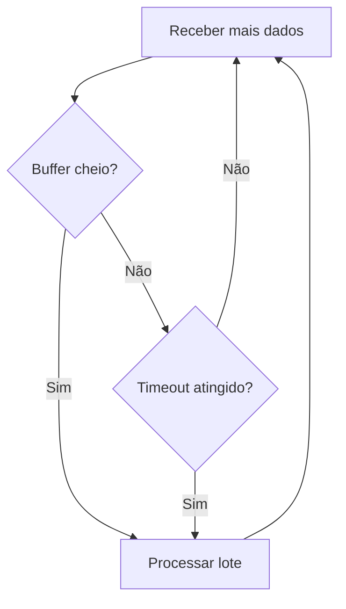
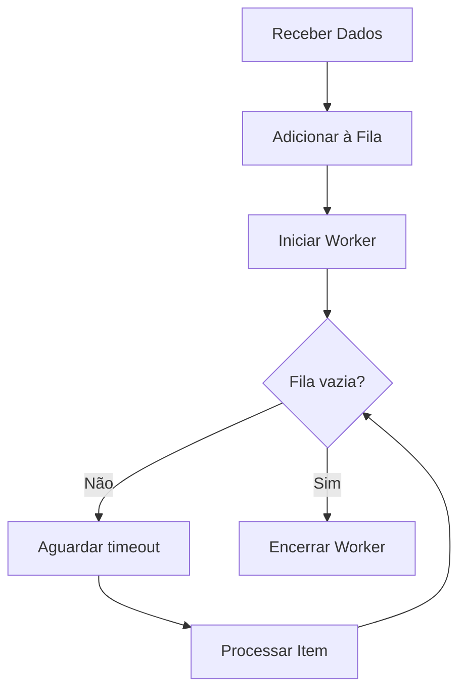
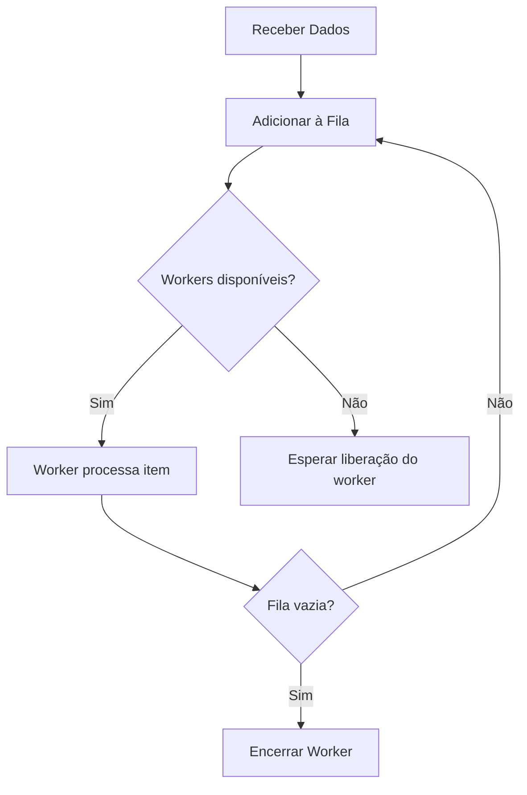

# 📥 Data Sinks Desvendados: Potencialize o Processamento de Dados com Exemplos em .NET 💾

Em sistemas de software, o termo **data sink** refere-se a um ponto de destino onde os dados são enviados para processamento, armazenamento ou análise. Ele é frequentemente utilizado em pipelines de dados, arquiteturas de streaming, ou sistemas baseados em eventos para gerenciar como e quando os dados são consumidos. Este artigo explora o conceito de **data sink**, apresenta diferentes implementações em .NET e discute casos de uso para cada abordagem.

> **Código-fonte completo**: Todas as implementações descritas neste artigo estão disponíveis no repositório GitHub: [Carubbi.DataSinks](https://github.com/rcarubbi/Carubbi.datasinks).

---

## O Que é um Data Sink?

Um **Data Sink** é um destino onde os dados são enviados para processamento, armazenamento ou análise. Ele pode ser configurado para:

- Processar dados em **lotes**.
- Adiar o processamento para otimizar recursos.
- Operar em tempo real, utilizando buffers e workers para gerenciar alta concorrência.
- **Escalar dinamicamente**, ajustando o número de workers de acordo com a demanda.

---

## Implementações de Data Sink em .NET

Neste artigo, apresentamos quatro implementações principais, cada uma projetada para cenários específicos.

---

### **1. Data Sink com Tamanho e Limite de Tempo**

Este data sink processa dados acumulados em **lotes**. Ele dispara o processamento quando:
- O número de itens no buffer atinge um limite pré-definido (por exemplo, 100 itens).
- Um intervalo de tempo é atingido (por exemplo, a cada 10 segundos), independentemente do número de itens no buffer.

#### **Benefícios:**
- Ideal para cenários em que **otimização de recursos** é importante, como enviar lotes de dados para APIs ou salvar registros em bancos de dados.

#### **Exemplo de Código:**

```csharp
var batchingSink = new BatchingDataSink<string>(
    batchSize: 10,
    timeLimit: TimeSpan.FromSeconds(5),
    processBatch: async batch =>
    {
        Console.WriteLine($"Processing batch: {string.Join(", ", batch)}");
        await Task.Delay(100); // Simula processamento
    });

await batchingSink.ProcessAsync("Item1");
await batchingSink.ProcessAsync("Item2");
// Adiciona mais itens...
await batchingSink.CompleteAsync();
```

#### **Diagrama:**



#### **Casos de Uso:**
- Exportação de logs em lotes para sistemas como Elasticsearch.
- Envio de métricas para um endpoint de monitoramento.

---

### **2. Data Sink com Processamento Atrasado**

Este data sink adia o processamento de cada item por um período especificado. Ele utiliza uma fila para armazenar os itens e processa em segundo plano.

#### **Benefícios:**
- Útil para cenários onde o **tempo de processamento precisa ser controlado**, como debouncing em sistemas de eventos.

#### **Exemplo de Código:**

```csharp
var delayedSink = new DelayedDataSink<string>(
    delay: TimeSpan.FromSeconds(3),
    process: async item =>
    {
        Console.WriteLine($"Processed after delay: {item}");
        await Task.Delay(100); // Simula processamento
    });

await delayedSink.ProcessAsync("ItemA");
await delayedSink.ProcessAsync("ItemB");
await delayedSink.CompleteAsync();
```

#### **Diagrama:**



#### **Casos de Uso:**
- Sistemas de notificações que acumulam mensagens antes de enviá-las.
- Debouncing de ações em interfaces gráficas ou sistemas de eventos.

---

### **3. Data Sink com Buffer e Controle de Workers**

Este data sink utiliza um **buffer** e uma quantidade configurável de **workers** para processar os dados assim que eles chegam. Se todos os workers estiverem ocupados, os dados são mantidos na fila até que um worker fique disponível.

#### **Benefícios:**
- Ideal para cenários de **alta concorrência**, onde múltiplos itens precisam ser processados simultaneamente.

#### **Exemplo de Código:**

```csharp
var bufferedSink = new BufferedDataSink<string>(
    maxWorkers: 3,
    process: async item =>
    {
        Console.WriteLine($"Processed by worker: {item}");
        await Task.Delay(300); // Simula processamento
    });

await bufferedSink.ProcessAsync("Task1");
await bufferedSink.ProcessAsync("Task2");
await bufferedSink.CompleteAsync();
```

#### **Diagrama:**



---

### **4. Elastic Worker Data Sink**

O **Elastic Worker Data Sink** leva o conceito de concorrência a um novo nível, escalando dinamicamente o número de workers com base no tamanho da fila e no fator de escalabilidade configurado. Ele é ideal para cenários onde a carga de trabalho pode variar drasticamente.

#### **Exemplo de Código**

```csharp
var elasticSink = new ElasticWorkerDataSink<string>(
    minWorkers: 2,
    maxWorkers: 10,
    scalingFactor: 4, // Ajusta os workers quando o tamanho da fila for 4x ou 1/4 dos workers atuais
    process: async item =>
    {
        Console.WriteLine($"Processing {item} by worker {Task.CurrentId}");
        await Task.Delay(200); // Simula processamento
    });

// Adicionando itens ao sink
await elasticSink.ProcessAsync("Item1");
await elasticSink.ProcessAsync("Item2");

// Finalizando o sink
await elasticSink.CompleteAsync();
```

---

## Benefícios do Elastic Worker Data Sink

1. **Escalabilidade Automática**: O número de workers aumenta ou diminui de forma dinâmica, baseado no tamanho da fila.
2. **Otimização de Recursos**: Reduz o consumo de recursos durante períodos de baixa carga.
3. **Configuração Flexível**: Permite ajustar os limites mínimos, máximos e o fator de escalabilidade para se adequar a diferentes cenários.

---

## **Como Escolher o Tipo Certo de Data Sink?**

A escolha do data sink depende do seu cenário:

- **BatchingDataSink**:
  - Use quando a eficiência e a agregação de dados são importantes.
  - Exemplo: Salvar logs ou métricas em lotes.

- **DelayedDataSink**:
  - Use quando o processamento deve ser adiado para evitar sobrecarga ou reagir a eventos com atraso controlado.
  - Exemplo: Notificações ou debouncing de eventos.

- **BufferedDataSink ou ElasticWorkerDataSink**:
  - Use quando há alta concorrência e você precisa gerenciar múltiplos processos simultaneamente.
  - Exemplo: Processar mensagens de filas distribuídas.

---

## **Melhores Práticas ao Implementar Data Sinks em .NET**

1. **Use Estruturas Thread-Safe:**
   - `ConcurrentQueue` para gerenciar filas de forma segura em ambientes multi-threaded.
2. **Controle de Concorrência:**
   - Utilize `SemaphoreSlim` para gerenciar workers e evitar condições de corrida.
3. **Design Assíncrono:**
   - Garanta que os métodos não bloqueiem threads usando `Task` e `Task.Delay`.
4. **Atenção ao Ciclo de Vida:**
   - Sempre forneça métodos como `CompleteAsync` para garantir que todo processamento seja concluído antes de encerrar o programa.

---

## **Conclusão**

Os data sinks são componentes essenciais para gerenciar o fluxo de dados em sistemas modernos. Este artigo apresentou três implementações em .NET, cada uma com aplicações específicas, como processamento em lotes, atraso controlado e alta concorrência.

> **Código Completo**: Todas as implementações estão disponíveis no repositório GitHub: [Carubbi.DataSinks](https://github.com/rcarubbi/Carubbi.datasinks).

A flexibilidade do .NET permite criar implementações robustas e reutilizáveis, tornando os data sinks ideais para diversas arquiteturas. Experimente as abordagens apresentadas e adapte-as às suas necessidades. 🚀

Se gostou do conteúdo ou tem dúvidas, deixe seu comentário!
