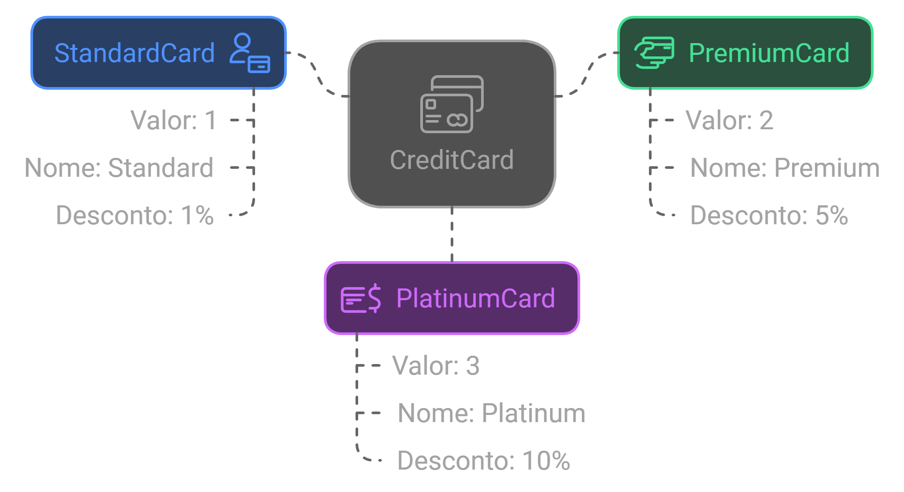

# 🔢 Enums Fortemente Tipados em C# - Um Guia Completo 💪

Enums em C# são amplamente usados para representar um conjunto de valores constantes, mas eles possuem limitações, como a impossibilidade de anexar comportamentos ou dados adicionais diretamente a esses valores. Neste artigo, vamos abordar essas limitações e, principalmente, criar uma implementação de enums fortemente tipados que adiciona comportamento e dados aos valores dos enums.

## Limitações dos Enums em C#

Vamos iniciar com uma implementação simples de um enum de cartão de crédito, onde temos tipos de cartão (Padrão, Premium, Platinum) e um `switch` que retorna um desconto baseado no tipo do cartão. Abaixo, vemos uma estrutura básica de código que imprime o tipo de cartão e o desconto:

```csharp
enum CreditCard
{
    Standard,
    Premium,
    Platinum
}

// Uso de switch para definir desconto baseado no tipo de cartão
var cardType = CreditCard.Platinum;
double discount = cardType switch
{
    CreditCard.Standard => 0.01,
    CreditCard.Premium => 0.05,
    CreditCard.Platinum => 0.1,
    _ => 0
};

Console.WriteLine($"O desconto para {cardType} é {discount * 100}%");
```

Essa abordagem funciona, mas traz alguns problemas:
1. **Manutenção**: Ao adicionar um novo valor ao enum, é necessário atualizar o `switch`.
2. **Extensibilidade**: Enums convencionais não permitem que comportamentos e dados específicos sejam atribuídos diretamente aos valores.

Para resolver isso, vamos implementar um enum fortemente tipado.

## Construindo um Enum Fortemente Tipado

Para começar, criaremos uma classe abstrata `Enumeration` que servirá como base para nossos enums fortemente tipados. Ela terá duas propriedades, `Value` e `Name`, que serão únicas para cada valor do enum. Esse padrão permite que adicionemos comportamentos específicos e simplifica a manipulação dos valores.

### Estrutura da Classe `Enumeration`

A classe `Enumeration` é genérica e implementa a interface `IEquatable`, que ajuda na comparação de instâncias. Abaixo está a estrutura inicial:

```csharp
public abstract class Enumeration<TEnum> : IEquatable<Enumeration<TEnum>>
    where TEnum : Enumeration<TEnum>
{
    public int Value { get; }
    public string Name { get; }

    protected Enumeration(int value, string name)
    {
        Value = value;
        Name = name;
    }

    public bool Equals(Enumeration<TEnum>? other)
    {
        if (other == null) return false;
        return GetType().Equals(other.GetType()) && Value.Equals(other.Value);
    }

    public override bool Equals(object? obj)
    {
        return obj is Enumeration<TEnum> other && Equals(other);
    }

    public override int GetHashCode() => Value.GetHashCode();
}
```

Aqui, `Value` e `Name` são inicializados apenas uma vez, garantindo que cada valor de enum tenha uma representação única. Também implementamos os métodos `Equals` e `GetHashCode` para permitir comparações.

### Métodos Estáticos para Recuperação de Valores

Adicionaremos métodos para buscar instâncias específicas do enum com base no `Value` ou `Name`. Usaremos um dicionário para armazenar e acessar rapidamente os valores, e métodos `CreateEnumerationsByValue` e `CreateEnumerationsByName` para inicializar esses dicionários:

```csharp
private static readonly Dictionary<int, TEnum> EnumerationsByValue = CreateEnumerationsByValue();
private static readonly Dictionary<string, TEnum> EnumerationsByName = CreateEnumerationsByName();

public static TEnum? FromValue(int value)
{
    return EnumerationsByValue.TryGetValue(value, out var enumValue) ? enumValue : null;
}

public static TEnum? FromName(string name)
{
    return EnumerationsByName.TryGetValue(name, out var enumValue) ? enumValue : null;
}

private static Dictionary<int, TEnum> CreateEnumerationsByValue()
{
    return typeof(TEnum)
        .GetFields(System.Reflection.BindingFlags.Public | System.Reflection.BindingFlags.Static | System.Reflection.BindingFlags.DeclaredOnly)
        .Where(f => f.FieldType == typeof(TEnum))
        .Select(f => (TEnum)f.GetValue(null)!)
        .ToDictionary(e => e.Value);
}

private static Dictionary<string, TEnum> CreateEnumerationsByName()
{
    return typeof(TEnum)
        .GetFields(System.Reflection.BindingFlags.Public | System.Reflection.BindingFlags.Static | System.Reflection.BindingFlags.DeclaredOnly)
        .Where(f => f.FieldType == typeof(TEnum))
        .Select(f => (TEnum)f.GetValue(null)!)
        .ToDictionary(e => e.Name);
}
```

Esses métodos usam reflexão para identificar os campos públicos e estáticos que correspondem a valores do enum, construindo os dicionários `EnumerationsByValue` e `EnumerationsByName`.

### Exemplo de Uso com Cartão de Crédito

Para ilustrar a funcionalidade, vamos aplicar nossa classe `Enumeration` criando uma classe `CreditCard`. Nessa classe, definimos cartões específicos e seus respectivos descontos.



```csharp
public abstract class CreditCard : Enumeration<CreditCard>
{
    public static readonly CreditCard Standard = new StandardCard();
    public static readonly CreditCard Premium = new PremiumCard();
    public static readonly CreditCard Platinum = new PlatinumCard();

    public abstract double Discount { get; }

    private CreditCard(int value, string name) : base(value, name) { }

    private sealed class StandardCard : CreditCard
    {
        public StandardCard() : base(1, "Standard") { }
        public override double Discount => 0.01;
    }

    private sealed class PremiumCard : CreditCard
    {
        public PremiumCard() : base(2, "Premium") { }
        public override double Discount => 0.05;
    }

    private sealed class PlatinumCard : CreditCard
    {
        public PlatinumCard() : base(3, "Platinum") { }
        public override double Discount => 0.1;
    }
}
```

Cada classe interna representa um tipo específico de cartão com um desconto específico. Esse design nos permite estender facilmente a classe para adicionar mais tipos de cartões com novos valores e comportamentos.

### Implementação de Métodos Auxiliares e Uso

Para buscar um valor com base em dados externos (por exemplo, valor vindo de uma API), usamos o método `FromValue` ou `FromName`.

```csharp
// Uso de FromValue para buscar um cartão pelo valor
var card = CreditCard.FromValue(1);
Console.WriteLine($"O desconto para {card?.Name} é {card?.Discount * 100}%");

// Uso de FromName para buscar um cartão pelo nome
var platinumCard = CreditCard.FromName("Platinum");
Console.WriteLine($"O desconto para {platinumCard?.Name} é {platinumCard?.Discount * 100}%");
```

Essa flexibilidade facilita a manipulação dos valores de enum sem precisar de `switch` ou verificações manuais adicionais.

## Conclusão

A implementação de enums fortemente tipados em C# permite que trabalhemos com tipos mais seguros e estendíveis. Ao encapsular comportamento específico em cada valor do enum, reduzimos a complexidade do código, melhoramos a legibilidade e aumentamos a segurança, especialmente em cenários que exigem manutenção frequente ou personalização de valores. Essa abordagem é útil para sistemas que necessitam de controle adicional e personalizações específicas nos valores de enum, como configurações de desconto para diferentes tipos de cartões.

Esse é apenas um exemplo de como criar enums fortemente tipados. A mesma abordagem pode ser estendida para adicionar métodos abstratos adicionais que sejam implementados por cada instância, proporcionando ainda mais flexibilidade e controle.

[Fonte](https://www.youtube.com/watch?v=v6cYTcEfZ8A)
