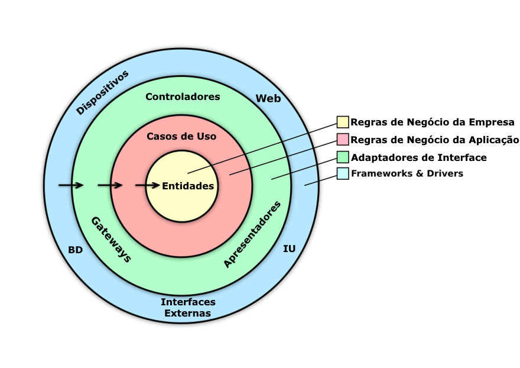

# 🛠️ Explorando a Arquitetura Limpa: Um Guia Prático 📖

A Arquitetura Limpa é uma abordagem de design de software que separa as responsabilidades do sistema em camadas bem definidas. Essa estrutura modular simplifica a manutenção e escalabilidade, promovendo a **separação de preocupações** e facilitando a compreensão e modificações no código. Vamos explorar como cada camada funciona e por que ela é importante.

Imagine um cenário em que seu sistema precisa suportar um novo banco de dados ou uma interface de usuário diferente. Com a Arquitetura Limpa, essas mudanças se tornam mais fáceis de lidar, pois a lógica central de negócios permanece inalterada por dependências externas. Como enfatiza o Uncle Bob, o centro da sua aplicação deve ser composto pelos **casos de uso** e a lógica de negócios, não frameworks ou bancos de dados.



## Por Que Escolher a Arquitetura Limpa?

A Arquitetura Limpa ajuda a mitigar vários problemas arquiteturais comuns:

- **Compromissos Precoces**: Arquiteturas tradicionais muitas vezes forçam as equipes a tomar decisões importantes no início de um projeto, quando o entendimento do domínio do problema ainda é mínimo. A Arquitetura Limpa incentiva o **adiamento de decisões** sobre frameworks, bancos de dados e outros detalhes até que sejam necessários, mantendo o design aberto a mudanças conforme os requisitos evoluem.
- **Sistemas Rígidos e Difíceis de Alterar**: Sem uma estrutura limpa, novos requisitos geralmente exigem uma solução "improvisada" ou uma reformulação custosa. Ao desacoplar as regras de negócio dos detalhes de implementação, a Arquitetura Limpa torna o sistema mais fácil de adaptar e expandir.
- **Design Centrado em Frameworks**: Frameworks devem ser ferramentas, não a própria arquitetura. Eles podem evoluir e introduzir mudanças incompatíveis, mas se o seu sistema for independente de framework, ele não será afetado de forma tão grave. Uncle Bob enfatiza que frameworks são detalhes e devem ser mantidos na periferia.
- **Pensamento Focado em Banco de Dados**: Muitos sistemas são construídos em torno do banco de dados, transformando tudo em operações CRUD. A Arquitetura Limpa trata o banco de dados como apenas mais um fornecedor de dados, garantindo que a lógica de negócios permaneça independente do banco de dados.
- **Lógica de Negócios Dispersa**: Quando as regras de negócio estão espalhadas por várias camadas, entender ou modificar o comportamento se torna difícil. A Arquitetura Limpa centraliza a lógica de negócios dentro dos **casos de uso**, tornando-a fácil de localizar e manter.
- **Testes Lentos e Frágeis**: O acoplamento da lógica de negócios com a interface de usuário ou o banco de dados pode tornar os testes lentos e frágeis. A Arquitetura Limpa promove o desacoplamento, permitindo testes de unidade rápidos e confiáveis que se concentram na lógica central.

## Conceitos-Chave da Arquitetura Limpa

### 1. Separação de Preocupações para Flexibilidade
A Arquitetura Limpa organiza responsabilidades em camadas distintas, reduzindo dependências e facilitando a manutenção. Cada camada tem um papel específico, resultando em uma base de código mais previsível e organizada.

### 2. Design Centrado no Domínio
A camada de domínio é o núcleo do sistema, encapsulando a **lógica de negócios** e as entidades essenciais. Ela é independente das outras camadas, aderindo estritamente aos requisitos de negócios e simplificando os testes de unidade.

### 3. Casos de Uso e Lógica de Aplicação
Os casos de uso são **regras de negócios específicas da aplicação** que coordenam interações entre entidades. Eles lidam com entrada e saída sem ter conhecimento de fontes de dados ou detalhes de apresentação.

- **Modelos de Requisição e Resposta**: Use estruturas de dados simples para desacoplar casos de uso de frameworks, mantendo a lógica central focada e testável.
- **CQRS (Separação de Responsabilidade de Comando e Consulta)**: O padrão CQRS separa as operações de leitura e escrita de dados, otimizando o desempenho e tornando o código mais claro. Essa abordagem garante que a camada de aplicação lide com a lógica de negócios sem preocupações com infraestrutura.

### 4. Infraestrutura como um Plugin
A camada de infraestrutura gerencia integrações externas, como bancos de dados e sistemas de mensagens, ocultando detalhes de implementação do restante da aplicação. Tratar a infraestrutura como **plugins** facilita a substituição ou modificação da tecnologia sem impactar a lógica de negócios.

- **Arquitetura Hexagonal**: Também conhecida como Ports and Adapters, esse padrão enfatiza uma separação limpa entre o núcleo e sistemas externos, aumentando a flexibilidade.

### 5. Camada de Apresentação: A Interface do Usuário
A camada de apresentação lida com a interação do usuário, frequentemente através de APIs RESTful ou gRPC. Ela delega a lógica de negócios para a camada de aplicação, focando apenas na entrada e saída.

### 6. Injeção de Dependência
A injeção de dependência é crucial para manter a integridade da arquitetura. Ela controla as dependências entre as camadas, permitindo flexibilidade e simplificando os testes.

## Exemplo Prático: Camadas e Funcionalidade

Vamos detalhar cada camada com exemplos práticos.

### Camada de Domínio

A **Camada de Domínio** define entidades de negócios e regras principais. Por exemplo, uma entidade `Webinar` pode ser assim:

```csharp
public class Webinar
{
    public Guid Id { get; private set; }
    public string Name { get; private set; }
    public DateTime ScheduledOn { get; private set; }

    public Webinar(string name, DateTime scheduledOn)
    {
        Id = Guid.NewGuid(); // Gera um identificador único para o webinar
        Name = name;
        ScheduledOn = scheduledOn;
    }

    public void Reschedule(DateTime newDate)
    {
        ScheduledOn = newDate;
    }
}
```

As entidades são **autocontidas** e evoluem com base nas necessidades de negócios, não em restrições de sistemas externos. Também definimos **interfaces de repositório** e **exceções personalizadas**:

```csharp
public interface IWebinarRepository
{
    Task<Webinar?> GetById(Guid id, CancellationToken cancellationToken);

    Task Add(Webinar webinar, CancellationToken cancellationToken);
}

public class WebinarNaoEncontradoException : Exception
{
    public WebinarNaoEncontradoException(Guid webinarId)
        : base($"Webinar com ID {webinarId} não foi encontrado.") { }
}
```

### Camada de Aplicação

A **Camada de Aplicação** gerencia os casos de uso e implementa **CQRS** para separar comandos e consultas, garantindo eficiência.

**Comando `CreateWebinarCommand`:**

```csharp
public class CreateWebinarCommand : IRequest<Guid>
{
    public string Nome { get; set; }
    public DateTime DataAgendada { get; set; }
}
```

**Manipulador `CreateWebinarCommandHandler`:**

```csharp
public class CreateWebinarCommandHandler : IRequestHandler<CreateWebinarCommand, Guid>
{
    private readonly IWebinarRepository _repository;

    public CreateWebinarCommandHandler(IWebinarRepository repository)
    {
        _repository = repository;
    }

    public async Task<Guid> Handle(CreateWebinarCommand command, CancellationToken cancellationToken)
    {
        var webinar = new Webinar(command.Nome, command.DataAgendada);
        await _repository.Add(webinar, cancellationToken);
        return webinar.Id;
    }
}
```

**Consulta `GetWebinarByIdQuery`:**

```csharp
public class GetWebinarByIdQuery : IRequest<Webinar?>
{
    public Guid Id { get; set; }
}
```

**Manipulador `GetWebinarByIdQueryHandler`:**

```csharp
public class GetWebinarByIdQueryHandler : IRequestHandler<GetWebinarByIdQuery, Webinar?>
{
    private readonly IWebinarRepository _repository;

    public GetWebinarByIdQueryHandler(IWebinarRepository repository)
    {
        _repository = repository;
    }

    public async Task<Webinar?> Handle(GetWebinarByIdQuery request, CancellationToken cancellationToken)
    {
        var webinar = await _repository.GetById(request.Id, cancellationToken);
        if (webinar is null)
            throw new WebinarNaoEncontradoException(request.Id);

        return webinar;
    }
}
```

Essa estrutura mantém os casos de uso isolados e facilmente testáveis.

### Camada de Infraestrutura

A **Camada de Infraestrutura** lida com integrações externas, como acesso ao banco de dados:

```csharp
public class WebinarRepository : IWebinarRepository
{
    private readonly AppDbContext _dbContext;

    public WebinarRepository(AppDbContext dbContext)
    {
        _dbContext = dbContext;
    }

    public async Task<Webinar?> GetById(Guid id, CancellationToken cancellationToken)
    {
        return await _dbContext.Webinars.FindAsync(id, cancellationToken);
    }

    public async Task Add(Webinar webinar, CancellationToken cancellationToken)
    {
        await _dbContext.Webinars.AddAsync(webinar, cancellationToken);
        await _dbContext.SaveChangesAsync(cancellationToken);
    }
}
```

Encapsulando essa lógica, o sistema permanece flexível a mudanças tecnológicas.

### Camada de Apresentação

A **Camada de Apresentação** fornece APIs para a interação do usuário:

```csharp
[ApiController]
[Route("api/[controller]")]
public class WebinarsController : ControllerBase
{
    private readonly IMediator _mediator;

    public WebinarsController(IMediator mediator)
    {
        _mediator = mediator;
    }

    [HttpPost]
    public async Task<IActionResult> CreateWebinar([FromBody] CreateWebinarCommand command)
    {
        var webinarId = await _mediator.Send(command);
        return CreatedAtAction(nameof(GetWebinar), new { id = webinarId }, webinarId);
    }

    [HttpGet("{id}")]
    public async Task<IActionResult> GetWebinar(Guid id)
    {
        var query = new GetWebinarByIdQuery { Id = id };
        var webinar = await _mediator.Send(query);
        return Ok(webinar);
    }
}
```

Ao delegar a lógica para a camada de aplicação, essa camada se concentra em **lidar com requisições e respostas**.

### Manipulação Centralizada de Erros com Middleware

A manipulação centralizada de erros melhora a experiência do usuário e a segurança:

```csharp
public class ExceptionHandlingMiddleware
{
    private readonly RequestDelegate _next;

    public ExceptionHandlingMiddleware(RequestDelegate next)
    {
        _next = next;
    }

    public async Task Invoke(HttpContext context)
    {
        try
        {
            await _next(context);
        }
        catch (WebinarNaoEncontradoException ex)
        {
            context.Response.StatusCode = StatusCodes.Status404NotFound;
            await context.Response.WriteAsJsonAsync(new { Erro = ex.Message });
        }
        catch (Exception ex)
        {
            context.Response.StatusCode = StatusCodes.Status500InternalServerError;
            await context.Response.WriteAsJsonAsync(new { Erro = ex.Message });
        }
    }
}
```

### Registro de Dependências no `Program.cs`

Configurando dependências no `Program.cs`:

```csharp
var builder = WebApplication.CreateBuilder(args);

builder.Services.AddControllers()
                .AddApplicationPart(typeof(WebinarsController).Assembly);

builder.Services.AddScoped<IWebinarRepository, WebinarRepository>();

builder.Services.AddMediatR(cfg => cfg.RegisterServicesFromAssemblies(typeof(CreateWebinarCommandHandler).Assembly));

builder.Services.AddDbContext<AppDbContext>(options =>
           options.UseInMemoryDatabase("webinarsDb"));

builder.Services.AddEndpointsApiExplorer();
builder.Services.AddSwaggerGen();

var app = builder.Build();

app.UseMiddleware<ExceptionHandlingMiddleware>();

if (app.Environment.IsDevelopment())
{
    app.UseSwagger();
    app.UseSwaggerUI();
}

app.UseHttpsRedirection();

app.UseAuthorization();

app.MapControllers();

app.Run();
```

### Benefícios e Compromissos da Arquitetura Limpa

- **Benefícios**: 
  - Facilita estratégias de teste eficazes.
  - Design independente de framework minimiza dependências externas.
  - Separação clara da lógica de negócios melhora a compreensão e modificação.
  - Suporta implantações incrementais e integração contínua.
- **Compromissos**: 
  - **Complexidade**: Introduzir múltiplas fronteiras pode adicionar sobrecarga. Use-as com sabedoria.
  - **Duplicação de Código**: Representações diferentes de entidades podem parecer redundantes, mas promovem o desacoplamento.

### Conclusão

A Arquitetura Limpa oferece uma estrutura modular e sustentável para software. Ao manter camadas bem definidas, os sistemas se tornam mais fáceis de manter e menos propensos a erros, prontos para requisitos e tecnologias em evolução.
