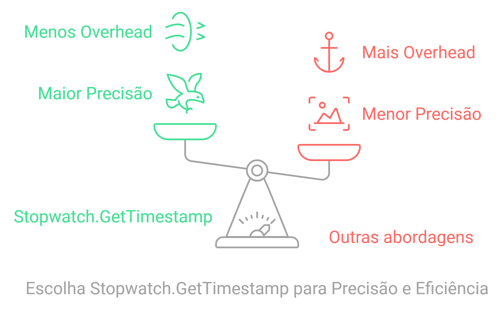

# ⏱️ Medindo Tempo de Execução com Alta Precisão no .NET 🎯

Medir o tempo de execução em aplicações .NET é uma tarefa comum ao otimizar o desempenho. No .NET Core, a melhor forma de capturar com precisão o tempo de execução de um método ou operação é usando `Stopwatch.GetTimestamp` em conjunto com `Stopwatch.GetElapsedTime`. Esse método é preferível a outras abordagens porque oferece maior precisão e menos overhead. Vamos entender o porquê e comparar com outras abordagens.



## 1. Medição de Tempo com `Stopwatch.GetTimestamp` e `Stopwatch.GetElapsedTime`

O uso do `Stopwatch.GetTimestamp` em conjunto com `Stopwatch.GetElapsedTime` oferece precisão ao medir o tempo de execução, sem o overhead de criação de objetos desnecessários. A estrutura do código é a seguinte:

```csharp
var timeStamp = Stopwatch.GetTimestamp();
// chamada do método que queremos medir
var elapsedTime = Stopwatch.GetElapsedTime(timeStamp);
```

### Principais Vantagens

1. **Precisão Alta**: `Stopwatch.GetTimestamp` obtém diretamente a contagem de "ticks" do relógio do sistema, o que representa um valor de alta precisão, normalmente em frequência de nanosegundos.
  
2. **Baixo Overhead**: Como ele não envolve a criação de um objeto `Stopwatch` nem chamadas adicionais para iniciar ou parar, ele minimiza a sobrecarga e a alocação de memória, resultando em medições mais rápidas e diretas.

3. **Controle Explícito de Tempo Decorrido**: A função `Stopwatch.GetElapsedTime` calcula o tempo decorrido com base no timestamp inicial, o que permite medições precisas de operações rápidas que poderiam ser influenciadas por latência adicional da criação de objetos.

## Comparação com Outras Abordagens

Agora, vamos comparar essa abordagem com métodos mais comuns de medição de tempo, destacando as limitações de cada um.

### 2. Medição com `DateTime.UtcNow`

Um método tradicional de medir o tempo é usando `DateTime.UtcNow` para capturar o momento de início e de fim, e subtraí-los:

```csharp
var startTime = DateTime.UtcNow; // chamada do método que queremos medir 
var delta = DateTime.UtcNow - startTime;
```

#### Problemas:
- **Baixa Precisão**: `DateTime.UtcNow` geralmente não tem a mesma precisão de `Stopwatch`, pois depende da resolução do relógio do sistema, que pode variar. Em muitas situações, a precisão pode ser de apenas alguns milissegundos, insuficiente para medições precisas em operações de alta performance.
  
- **Overhead de Sistema Operacional**: Como `DateTime.UtcNow` depende do relógio do sistema, ele está sujeito a interferências de processos de atualização do sistema operacional, o que pode causar desvios na medição.

### 3. Medição com Instância `Stopwatch`

Uma abordagem muito comum é criar uma instância de `Stopwatch` e utilizar os métodos `Start` e `Stop`:

```csharp
var stopWatch = new Stopwatch(); 
stopWatch.Start(); // chamada do método que queremos medir 
stopWatch.Stop(); 
var elapsed = stopWatch.ElapsedMilliseconds;
```

#### Problemas:
- **Overhead de Alocação**: Ao criar uma nova instância de `Stopwatch`, há um custo associado à alocação de memória e inicialização do objeto, o que pode interferir no desempenho em medições muito rápidas.
  
- **Necessidade de Chamadas Adicionais**: Métodos como `Start` e `Stop` adicionam chamadas extras que, para operações de micro e milissegundos, podem distorcer a precisão da medição.

### 4. Medição com `Stopwatch.StartNew()`

`Stopwatch.StartNew()` é uma alternativa para iniciar e iniciar imediatamente um `Stopwatch`:

```csharp
var stopWatch = Stopwatch.StartNew(); // chamada do método que queremos medir 
stopWatch.Stop(); 
var elapsed = stopWatch.ElapsedMilliseconds;
```


#### Problemas:
- **Açúcar Sintático**: `Stopwatch.StartNew()` é apenas uma forma abreviada de instanciar um `Stopwatch` e iniciar sua contagem. Os mesmos problemas de overhead de criação de instância e chamadas adicionais permanecem, o que pode introduzir imprecisões para medições de curta duração.

## Conclusão

Quando buscamos a forma mais performática para medir o tempo de execução em .NET Core, `Stopwatch.GetTimestamp` com `Stopwatch.GetElapsedTime` é a melhor escolha. Ela combina alta precisão, baixo overhead e evita as armadilhas de instanciar objetos adicionais, sendo, portanto, ideal para medir o tempo em operações rápidas ou de baixo nível.

Essa prática é especialmente útil em ambientes de alta performance ou em cenários onde qualquer variação na medição pode impactar a análise do desempenho, permitindo que o desenvolvedor tenha uma visão clara e confiável do tempo exato de execução da operação.
