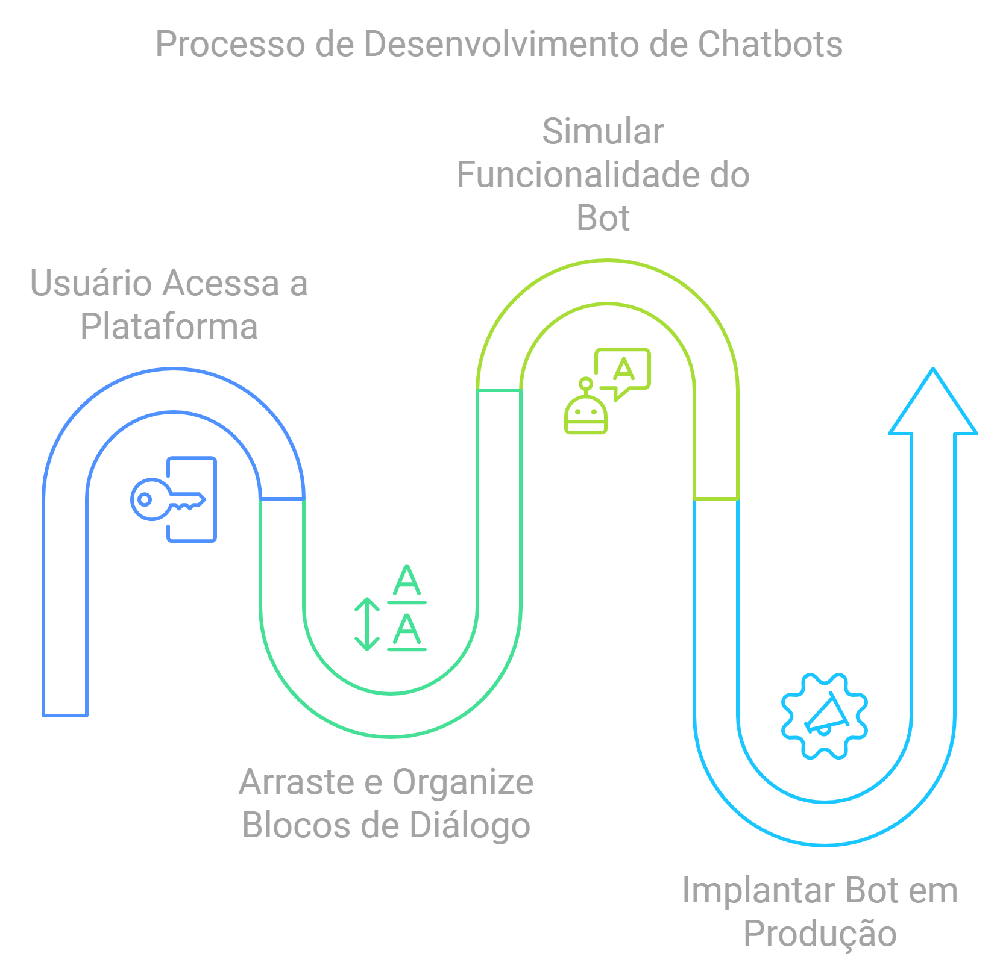

# 🤖 Os desafios de criar uma plataforma web para construir Chatbots 🧩

Criar uma plataforma de chatbot que equilibre simplicidade com recursos avançados não é tarefa fácil. Foi isso que eu busquei alcançar com o [Carubbi.ChatbotStudio](https://github.com/rcarubbi/Carubbi.ChatbotStudio), uma plataforma baseada na web que permite aos usuários projetar fluxos de conversação visualmente usando **Blockly**. A interface torna o desenvolvimento de chatbots acessível para pessoas sem conhecimento em programação, enquanto ainda oferece funcionalidades poderosas para aqueles que desejam personalizar interações e integrar vários serviços. Aqui está um resumo de como esse projeto ganhou vida, desde a concepção até a implementação.

---

## 1. **A Visão por Trás da Plataforma**

Meu objetivo para o ChatbotStudio era claro: simplificar a criação de chatbots sem sacrificar a flexibilidade. Os principais objetivos incluíam:

- **Interface Visual Amigável**: Usuários podem construir fluxos de conversa arrastando e conectando blocos visuais, facilitando a criação de diálogos complexos para qualquer pessoa.
- **Testes em Tempo Real**: Um ambiente de teste integrado para simular conversas e ajustar os fluxos sem complicações.
- **Ambientes Separados para Desenvolvimento e Produção**: Para evitar impactar o chatbot ao vivo durante atualizações e testes.



## 2. **Stack de Tecnologia**

Escolher as ferramentas certas foi fundamental. Veja o que impulsiona o ChatbotStudio:

- **Backend**: Microsoft Bot Framework, escrito em C#.
- **Frontend**: Blockly para programação visual baseada em blocos, combinado com React e HTML5.
- **Simulador de Teste em Tempo Real**: Uma interface de chatbot integrada para testar e refinar os fluxos de conversação.

### Por que Blockly e Microsoft Bot Framework?

- **Blockly**: Ofereceu uma base robusta para criar a experiência de design visual, onde os usuários podem construir fluxos intuitivamente com blocos.
- **Microsoft Bot Framework**: Um backend confiável e escalável para lidar com a lógica e execução dos chatbots.

---

## 3. **Implementando a Interface Visual com Blockly**

Configurar o Blockly foi um passo crucial no projeto. A interface permite que os usuários construam a lógica do chatbot organizando blocos que representam diferentes ações, como fazer uma pergunta ou chamar uma API externa.

### Principais Funcionalidades:

1. **Blocos Personalizados do Blockly**: Cada bloco representa uma ação específica do chatbot, como enviar uma mensagem, capturar uma entrada ou navegar para outro passo no fluxo.  
   Para criar novos blocos personalizados, você pode usar as [Ferramentas de Desenvolvedor do Blockly](https://blockly-demo.appspot.com/static/demos/blockfactory/index.html). Esta ferramenta ajuda a gerar o código de definição do bloco, assim como a configuração da toolbox e do workspace, facilitando a integração de novos blocos no seu projeto.

   **Exemplo** (do `customblocks.js`):
   ```javascript
   // Definir um bloco personalizado para enviar mensagens
   const jsonBotDefinitionBlocks = [
     {
       "type": "messagestep",
       "message0": "%1 Mensagem %2", // Texto exibido no bloco
       "args0": [
         { "type": "field_label_serializable", "name": "Id", "text": "" }, // Campo de rótulo
         { "type": "input_value", "name": "Messages", "check": "MessageInteractions" } // Campo de entrada para mensagens
       ],
       "previousStatement": null, // Indica que este bloco pode se conectar a blocos acima
       "nextStatement": null, // Indica que este bloco pode se conectar a blocos abaixo
       "colour": 90, // Cor do bloco
       "tooltip": "Passo de Mensagem", // Tooltip do bloco
       "helpUrl": "" // URL de ajuda para informações adicionais
     },
     // Definições de blocos adicionais...
   ];
   ```

2. **Representação do Fluxo**: Para facilitar a visualização da estrutura da conversa, implementei um diagrama de fluxo dinâmico usando flowchart.js. Essa biblioteca gera diagramas de fluxo a partir de uma linguagem de script simples. Para conectar os blocos do Blockly ao diagrama de fluxo, desenvolvi um parser personalizado que converte as estruturas dos blocos no formato de script exigido pelo flowchart.js. Essa integração oferece aos usuários uma visão visual intuitiva de seus fluxos de conversação.

3. **Saída JSON Personalizada**: Um gerador personalizado foi desenvolvido para converter os blocos em um formato JSON estruturado que o backend possa processar.

   **Exemplo** (do `codeGenerator.js`):
   ```javascript
   // Gerador para converter o workspace do Blockly em JSON
   const JsonBotDefinition = new Blockly.Generator('JsonBotDefinition');

   // Função para extrair blocos do workspace e converter em JSON
   JsonBotDefinition.fromWorkspace = (workspace) => {
       let top_blocks = workspace.getTopBlocks(false); // Obter blocos de nível superior
       for (let block of top_blocks) {
           if (block.type === 'botconfig')
               return JsonBotDefinition.generalBlockToObj(block, workspace); // Converter bloco em JSON
       }
   };

   // Função para lidar com a conversão de blocos individuais
   JsonBotDefinition.generalBlockToObj = (block, workspace) => {
       if (block && !block.isShadow_) { // Ignorar blocos sombreados
           let func = JsonBotDefinition[block.type]; // Obter a função de conversão para o tipo de bloco
           if (func) {
               return func.call(JsonBotDefinition, block, workspace); // Chamar a função para gerar o JSON
           } else {
               console.log("Tipo de bloco desconhecido: " + block.type); // Log se o tipo de bloco for desconhecido
           }
       }
       return null; // Retornar nulo se o bloco não for válido
   };
   ```

---

## 4. **Integração com o Backend: Fazendo as Conversas Funcionar**

O backend, construído com o Microsoft Bot Framework, interpreta o fluxo JSON do frontend e executa a lógica do chatbot. Veja como funciona:

- **Parsing do JSON**: O backend traduz as instruções JSON em ações do bot, como exibir mensagens ou lidar com a entrada do usuário.

### Exemplo: Manipulando uma Mensagem Simples

**Exemplo** (do `MessageDialog.cs`):
```csharp
// Executar a ação de início do diálogo
protected override async Task PerformStartAsync(IDialogContext context)
{
    // Criar uma atividade de mensagem a partir dos detalhes configurados do passo
    var message = await CreateActivityWithMessage(context, _step.Messages, string.Format(Constants.DEFAULT_MESSAGE, _step.Id));
    await context.PostAsync(message); // Enviar a mensagem para o usuário

    // Verificar se há um próximo passo no fluxo de conversa
    if (_step.NextStepId.HasValue)
    {
        var nextStep = GetStep(_step.NextStepId.Value); // Recuperar o próximo passo
        var dialog = nextStep.MakeDialog(_botConfig, context.Activity, _parentStep); // Criar um diálogo para o próximo passo

        if (dialog != null)
        {
            context.Call(dialog, GoBack); // Continuar a conversa com o próximo passo
        }
        else
        {
            context.Done<object>(null); // Encerrar a conversa se nenhum diálogo for encontrado
        }
    }
    else
    {
        context.Done<object>(null); // Encerrar a conversa se não houver próximo passo
    }
}
```

---

## 5. **Trabalhando com Mapas e Serviços de Localização**

O arquivo `MapsDialog.cs` ilustra como a plataforma se integra com serviços de mapas para fornecer funcionalidades baseadas em localização.

**Exemplo** (do `MapsDialog.cs`):
```csharp
// Executar a ação de início do diálogo de mapas
protected override async Task PerformStartAsync(IDialogContext context)
{
    var message = context.MakeMessage(); // Criar uma nova atividade de mensagem
    message.AttachmentLayout = AttachmentLayoutTypes.Carousel; // Definir o layout para múltiplos anexos

    // Analisar as localizações da entrada e armazená-las na saída
    var locations = (await ParseLocations(_step.Input)).ToList();
    _step.Output.Locations = locations;
    PersistOutput(context, _step.Output); // Salvar a saída

    // Criar cartões hero para cada localização e adicioná-los à mensagem
    var cards = CreateHeroCards(locations, 
        locations.Select(x => x.Name).ToArray(),
        _step.Selectable ? locations.Select(x => x.Id).ToArray() : null);

    foreach (var card in cards)
    {
        message.Attachments.Add(card.ToAttachment()); // Adicionar cada cartão como anexo
    }

    await context.PostAsync(message); // Enviar a mensagem para o usuário

    if (_step.Selectable)
        context.Wait(LocationSelectedAsync); // Aguardar o usuário selecionar uma localização
    else
    {
        if (_step.NextStepId.HasValue)
        {
            var nextStep = GetStep(_step.NextStepId.Value); // Obter o próximo passo
            var dialog = nextStep.MakeDialog(_botConfig, context.Activity, _parentStep); // Criar o próximo diálogo
            context.Call(dialog, GoBack); // Continuar a conversa
        }
        else
        {
            context.Done<object>(null); // Encerrar a conversa se não houver próximo passo
        }
    }
}
```

---

## 6. **Melhorias na Experiência do Usuário: Intellisense e Testes em Tempo Real**

### Intellisense para Configuração Fácil

Para simplificar a configuração de expressões, implementei o **Intellisense**. Esse recurso sugere etapas e valores capturados anteriormente enquanto o usuário digita e inclui um sistema de **Auto-Complete** que sugere dinamicamente valores de entrada para campos específicos, melhorando a experiência do usuário e reduzindo erros.

**Exemplo** (do `FieldAutoComplete.js`):
```javascript
// Campo de auto-completar personalizado para Blockly
export class FieldAutoComplete extends Blockly.FieldTextInput {
    // Função debounce para limitar a frequência de chamadas de API
    debounce(func, timeout = 500) {
        return (...args) => {
            clearTimeout(this.timer);
            this.timer = setTimeout(() => { func.apply(this, args); }, timeout);
        };
    }

    // Buscar sugestões da URL do serviço
    async fetchSuggestions(term) {
        try {
            const response = await fetch(`${this.serviceUrl}${term}`);
            return response.status === 200 ? await response.json() : []; // Retornar sugestões se a resposta for bem-sucedida
        } catch {
            return []; // Retornar um array vazio em caso de erro
        }
    }

    // Mostrar as sugestões em um dropdown
    async showSuggestions(term) {
        const results = await this.fetchSuggestions(term); // Buscar sugestões
        if (results.length > 0) {
            const editor = this.dropdownCreate_(results); // Criar o dropdown
            Blockly.DropDownDiv.getContentDiv().appendChild(editor); // Adicionar o dropdown ao conteúdo do Blockly
        }
    }
}
```

### Testes em Tempo Real e Validação do Fluxo

Um dos principais destaques da plataforma é o **simulador de testes em tempo real**. O webchat embutido, que é a interface do webchat fornecida pela Microsoft, usa o **DirectLine** para interagir com o Microsoft Bot Framework. Essa integração garante que o chatbot possa ser testado em um ambiente ao vivo, permitindo ajustes em tempo real. O simulador permite que os desenvolvedores verifiquem o comportamento do bot e garantam que tudo funcione perfeitamente antes de entrar em produção.

---

## 7. **Gerenciando Ambientes de Desenvolvimento e Produção**

A plataforma gerencia os ambientes de desenvolvimento e produção de forma estruturada:

- **Instâncias da API**: Duas instâncias separadas da API estão disponíveis: uma para **staging** e outra para **produção ao vivo**.
- **Fluxo de Publicação**: Quando o usuário está satisfeito com um fluxo de conversa, ele pode publicá-lo no ambiente ao vivo usando a interface da plataforma.
- **Gerenciamento de Versões**:
  - Se qualquer modificação for feita após a publicação de um fluxo, uma nova versão do fluxo é automaticamente criada.
  - Esta nova versão é implantada no **ambiente de staging** para teste e verificação.
- **Atualizações Sem Interrupções**: Essa configuração garante que todas as mudanças sejam devidamente testadas antes de serem promovidas para o ambiente ao vivo, oferecendo um processo de lançamento seguro e eficiente.

---

## 🚀 **Participe!**

O ChatbotStudio é open-source e está pronto para colaboração. Confira no [GitHub](https://github.com/rcarubbi/Carubbi.ChatbotStudio) para explorar o código, contribuir ou adaptá-lo para seus próprios projetos. Para ver de perto, assista à demo no YouTube: [Assista Aqui](https://www.youtube.com/watch?v=Ri5ABGHxGq0).
Para ver a ferramenta em ação, você também pode assistir a esses clipes curtos de demonstração abaixo:

https://user-images.githubusercontent.com/1128724/168243164-812d8af8-a24b-4f11-a46c-f85d82017d64.mp4

https://user-images.githubusercontent.com/1128724/168454581-0590a0ca-59f2-4098-9299-c5a4563bde78.mp4

Adoraria ouvir seu feedback ou sugestões para futuras melhorias! Vamos juntos expandir os limites do desenvolvimento de chatbots.

---
