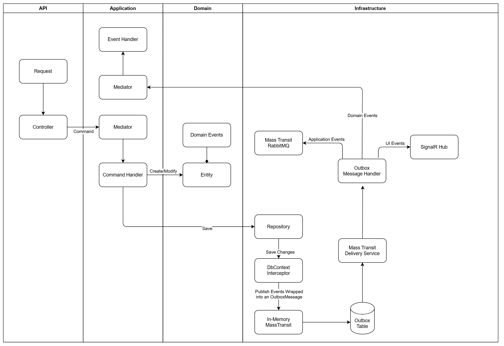
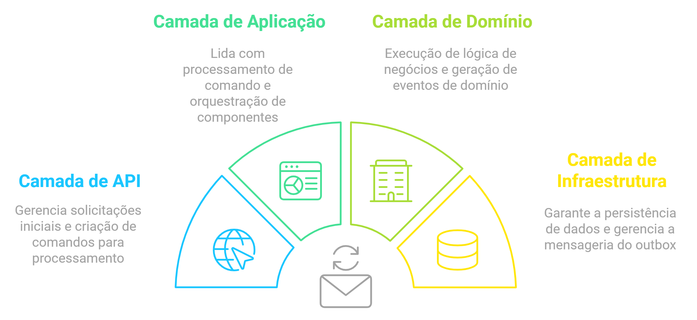

# ✉️ Outbox Pattern: Garanta a Consistência de Dados com Mensageria no .NET com MassTransit e Entity Framework Core 📬

Manter a consistência de dados em sistemas distribuídos é um dos grandes desafios que os desenvolvedores enfrentam. Imagine um cenário típico: você está construindo uma API que cria novos usuários, e além de salvar os dados do usuário no banco de dados, é necessário enviar um e-mail de verificação ou acionar outros serviços externos. O problema surge quando a operação de banco de dados é bem-sucedida, mas a notificação falha devido a uma falha na rede ou na disponibilidade do sistema de mensageria. Nesse caso, você terá um estado inconsistente, com o usuário criado no banco de dados, mas sem a ação de notificação ter ocorrido.

O *Outbox Pattern* resolve este problema ao garantir que operações de banco de dados e eventos de mensageria sejam executados de forma atômica e confiável.

---

### O Que é o Outbox Pattern?

O *Outbox Pattern* é um padrão de design que ajuda a garantir que operações de banco de dados e a publicação de eventos sejam feitas de forma atômica. Ele funciona armazenando eventos em uma tabela dedicada no banco de dados (a tabela de outbox) como parte da mesma transação que manipula os dados principais. Em seguida, um processador assíncrono lê esses eventos da tabela de outbox e os publica no sistema de mensageria (por exemplo, RabbitMQ).

A chave para este padrão é que a operação de persistência no banco de dados e o armazenamento dos eventos na tabela de outbox são feitos na mesma transação, garantindo que ambas as operações sejam bem-sucedidas ou nenhuma delas seja. Isso evita inconsistências entre o estado da aplicação e os eventos distribuídos.

---

### Entendendo o MassTransit

O MassTransit é uma biblioteca .NET para comunicação baseada em mensagens que facilita a integração de mensagens assíncronas com suporte a vários provedores de transporte, como RabbitMQ, Azure Service Bus, Amazon SQS, entre outros. Ele fornece abstrações robustas para lidar com mensagens, filas, eventos e integrações com o Entity Framework Core, tornando-o uma escolha ideal para aplicações que requerem comunicação assíncrona confiável.

### Funcionalidade de Outbox Nativa no MassTransit com EF Core

O MassTransit oferece suporte nativo ao Outbox Pattern em conjunto com o Entity Framework Core. Ele permite que as mensagens sejam gerenciadas e processadas automaticamente, integrando-se ao ciclo de vida das transações do EF Core.

Veja como configurar isso em um projeto:

```csharp
services.AddMassTransit(x =>
{
    x.AddConsumer<OutboxMessageWrapperConsumer>();
    x.AddEntityFrameworkOutbox<ApplicationDbContext>(cfg =>
    {
        cfg.UseSqlServer(); // Configuração para SQL Server
        cfg.UseBusOutbox(y =>
        {
            //y.DisableDeliveryService(); // Desabilitar o serviço de entrega se necessário
        });
    });

    // Configuração para mensagens em memória
    x.UsingInMemory((ctx, cfg) =>
    {
        cfg.ConfigureEndpoints(ctx);
        cfg.UseMessageRetry(retryCfg =>
        {
            retryCfg.Interval(5, TimeSpan.FromSeconds(5)); // Tentativas de reenvio
        });
    });
});
```

**Explicação**:
- **`AddEntityFrameworkOutbox`**: Configura o Outbox Pattern usando EF Core. As mensagens são persistidas na tabela de outbox e entregues de forma segura.
- **`UseBusOutbox`**: Habilita o envio das mensagens de forma assíncrona, garantindo que o Outbox Pattern seja processado corretamente.
- **Mensagens em Memória**: Uma configuração útil para gerenciar a entrega inicial e as tentativas de reenvio.

---

### Explicação do Projeto de Exemplo

O projeto de exemplo implementa o Outbox Pattern dentro de uma estrutura baseada na Clean Architecture. Para uma compreensão mais profunda da Clean Architecture, confira este [artigo](https://www.tabnews.com.br/raphaelcarubbi/explorando-a-arquitetura-limpa-um-guia-pratico).

#### Estrutura das Camadas

1. **Camada de API**: Expõe os endpoints e gerencia as requisições HTTP.
2. **Camada de Aplicação**: Orquestra a lógica de negócio. Aqui, usamos *Command Handlers* para encapsular operações. Por exemplo:
   ```csharp
   internal sealed class UpdateProductPriceCommandHandler(IProductRepository productRepository, IEventDispatcher eventDispatcher)
       : IRequestHandler<UpdateProductPriceCommand>
   {
       public async Task Handle(UpdateProductPriceCommand request, CancellationToken cancellationToken)
       {
           var product = await productRepository.GetById(request.Id, cancellationToken)
               ?? throw new ProductNotFoundException(request.Id);

           product.ChangePrice(request.Price);

           var applicationEvent = new ProductPriceUpdated(product.Id, product.Price);
           await eventDispatcher.Dispatch(applicationEvent, cancellationToken);

           await productRepository.Update(product, cancellationToken);
       }
   }
   ```
   - **Explicação**: O *Command Handler* atualiza o preço do produto, dispara um evento de aplicação (`ProductPriceUpdated` na camada de aplicação) e persiste as alterações.

3. **Camada de Domínio**: Define as entidades e eventos de domínio. Uma entidade base como `Entity` gerencia eventos de domínio em memória:
   ```csharp
   public abstract class Entity
   {
       private readonly List<IDomainEvent> _domainEvents = new();
       public IReadOnlyCollection<IDomainEvent> DomainEvents => _domainEvents.AsReadOnly();

       protected void AddDomainEvent(IDomainEvent domainEvent)
       {
           _domainEvents.Add(domainEvent);
       }

       public void ClearDomainEvents() => _domainEvents.Clear();
   }
   ```

   Uma entidade concreta, como `Product`, herda de `Entity` e pode gerar eventos de domínio:
   ```csharp
   public class Product(string name, decimal price) : AggregateRoot(Guid.NewGuid())
   {
       public string Name { get; private set; } = name;
       public decimal Price { get; private set; } = price;

       public void ChangePrice(decimal newPrice)
       {
           var oldPrice = Price;
           Price = newPrice;
           RaiseEvent(new ProductPriceChanged(Id, oldPrice, newPrice));
       }
   }
   ```

4. **Camada de Infraestrutura**: Implementa a persistência e configurações de mensageria. O `DomainEventsInterceptor` é um componente essencial que intercepta operações de persistência e dispara eventos de domínio:
   ```csharp
   public sealed class DomainEventsInterceptor : SaveChangesInterceptor
   {
       public override ValueTask<InterceptionResult<int>> SavingChangesAsync(
        DbContextEventData eventData,
        InterceptionResult<int> result,
        CancellationToken cancellationToken = default)
    {

        DbContext? dbContext = eventData.Context;

        if (dbContext is null)
        {
            return base.SavingChangesAsync(eventData, result, cancellationToken);
        }

        var events = dbContext.ChangeTracker
              .Entries<AggregateRoot>()
              .Select(x => x.Entity)
              .SelectMany(aggregateRoot =>
              {
                  var domainEvents = aggregateRoot.GetDomainEvents();

                  aggregateRoot.ClearDomainEvents();

                  return domainEvents;
              })
              .Select(x => new OutboxMessageWrapper
              {
                  Payload = JsonConvert.SerializeObject(x),
                  MessageType = x.GetType().AssemblyQualifiedName!,
              })
              .ToList();

        var bus = dbContext.GetService<IPublishEndpoint>();
        bus.PublishBatch(events, cancellationToken);

        return base.SavingChangesAsync(eventData, result, cancellationToken);
    }
   }
   ```

   - **Explicação**: O `DomainEventsInterceptor` intercepta as operações de salvamento no EF Core, identifica as entidades que possuem eventos de domínio em memória e publica esses eventos usando o MassTransit.

---



O diagrama do projeto ilustra um fluxo arquitetural abrangente para implementar o Outbox Pattern, combinando MassTransit, RabbitMQ e Mediatr. A integração entre as diferentes camadas garante consistência de dados e um desempenho eficiente. Vamos detalhar como cada camada contribui para esse fluxo:

#### Camada de API:

- A requisição inicial chega ao *Controller*, que cria um *Command* correspondente à ação desejada (como criar ou atualizar uma entidade) e o envia para o *Mediator*.

#### Camada de Aplicação:

- O *Mediator* recebe o *Command* e o encaminha para o *Command Handler* apropriado.
- O *Command Handler* executa a lógica de negócio, realizando operações de criação ou modificação em entidades específicas que podem resultar na geração de *Domain Events* em memória.
- Durante a execução, o *Command Handler* pode gerar *Applciation Events* para sinalizar que algo importante aconteceu (por exemplo, uma atualização de preço de produto).
  
#### Camada de Domínio:

- As entidades de domínio geram e disparam Domain Events conforme necessário. Esses eventos são críticos para desencadear operações de negócio associadas, como notificações ou atualizações em tempo real.

#### Camada de Infraestrutura:

- O Repository persiste as mudanças no banco de dados.
- O *DomainEventsInterceptor* intercepta as operações de persistência do EF Core, capturando os *Domain Events*. Ele os encapsula como mensagens Outbox e os armazena na Outbox Table na mesma transação.
- A instância principal do *MassTransit* está configurado para usar mensagens em memória, uma vez que seu papel é enviar as mensagens persistidas na tabela de outbox para o *OutboxMessageWrapperConsumer* através do seu serviço de entrega interno que roda em background.
  


### Processamento pelo *OutboxMessageWrapperConsumer*:

- Quando uma mensagem é entregue ao *OutboxMessageWrapperConsumer*:
    - *Domain Events*: Se a mensagem representa um evento de domínio, o *OutboxMessageWrapperConsumer* encaminha o evento de volta para o Mediator. Isso garante que o processamento dos eventos de domínio ocorra em memória, possibilitando a execução de ações de negócio adicionais sem sair da aplicação.
    - Eventos de Aplicação: Se a mensagem é um evento de aplicação (como notificações externas ou atualizações), ela é enviada para a outra instância do MassTransit com RabbitMQ, para ser entregue a outros serviços.
    - Eventos de UI: Eventos que impactam a interface do usuário são encaminhados ao SignalR Hub para comunicação em tempo real, permitindo atualizações instantâneas nos clientes conectados.

```csharp
internal class OutboxMessageWrapperConsumer : IConsumer<OutboxMessageWrapper>
{
    private readonly MediatR.IMediator _mediator;
    private readonly Bind<IExternalBus, IPublishEndpoint> _publishEndpoint;
    private readonly IHubContext<NotificationHub> _hubContext;
    private readonly ILogger<OutboxMessageWrapperConsumer> _logger;
    public OutboxMessageWrapperConsumer(
        MediatR.IMediator mediator,
        Bind<IExternalBus, IPublishEndpoint> publishEndpoint,
        IHubContext<NotificationHub> hubContext
        )
    {
        _mediator = mediator;
        _publishEndpoint = publishEndpoint;
        _hubContext = hubContext;
    }

    public async Task Consume(ConsumeContext<OutboxMessageWrapper> context)
    {
        await RouteEvent(context.Message);
    }

    private async Task RouteEvent(OutboxMessageWrapper eventMessage)
    {
        var messageType = Type.GetType(eventMessage.MessageType);
        var @event = JsonConvert.DeserializeObject(eventMessage.Payload, messageType!);

        try
        {
            switch (@event)
            {
                case IDomainEvent:
                    await _mediator.Publish(@event);
                    break;
                case IApplicationEvent:
                    await _publishEndpoint.Value.Publish(@event);
                    break;
                case IUiEvent:
                    await _hubContext.Clients.All.SendAsync("ReceiveMessage", @event);
                    break;
            }
        }
        catch (Exception ex)
        {
            _logger.LogError(ex, "Error while processing event");
        }
    }
}
```

#### Uso do MultiBus

O projeto utiliza o **MultiBus** do MassTransit para separar o fluxo de mensagens:
- **Instância Padrão**: Processa eventos em memória e integra o Outbox Pattern.
- **Instância `IExternalBus`**: Publica eventos de aplicação externamente via RabbitMQ. Essa abordagem isola eventos internos de eventos externos, proporcionando uma arquitetura mais modular e flexível.

**Configuração do MultiBus**:
```csharp
services.AddMassTransit<IExternalBus>(x =>
{
    x.AddConsumers(typeof(ApplicationLayer.Extensions.ServiceCollectionExtensions).Assembly);
    x.UsingRabbitMq((context, cfg) =>
    {
        cfg.Host(configuration.GetSection("RabbitMq:Host").Value,
                 configuration.GetSection("RabbitMq:VirtualHost").Value, h =>
        {
            h.Username(configuration.GetSection("RabbitMq:Username").Value!);
            h.Password(configuration.GetSection("RabbitMq:Password").Value!);
        });

        cfg.ConfigureEndpoints(context);
    });
});
```

**Motivação para Usar MultiBus**:
- **Isolamento de Fluxos**: Separa eventos internos e externos, tornando o sistema mais organizado.
- **Configurações Independentes**: Cada barramento pode ter sua própria configuração, permitindo otimizar as políticas de comunicação para diferentes cenários. Por exemplo, eventos internos podem ser processados de maneira mais simples e rápida, enquanto eventos externos, que exigem mais segurança e confiabilidade, podem utilizar uma infraestrutura mais robusta como o RabbitMQ ou Amazon SQS.

---

O Outbox Pattern é uma estratégia fundamental para manter a consistência de dados em sistemas distribuídos, e sua implementação em .NET é facilitada com o MassTransit e o EF Core. A Clean Architecture mantém o projeto organizado, modular e fácil de escalar, enquanto o MultiBus do MassTransit oferece flexibilidade para gerenciar diferentes fluxos de mensagens com eficiência.

O projeto de exemplo ilustra como você pode integrar essas tecnologias para construir uma aplicação robusta. Desde a persistência das entidades até a publicação segura dos eventos, cada camada da arquitetura desempenha um papel essencial. O uso do DomainEventsInterceptor é crucial para garantir que eventos de domínio sejam tratados corretamente em memória antes de serem publicados, evitando inconsistências.

Se você quer aplicar essa abordagem no seu projeto ou explorar o código em detalhes, acesse o repositório OutboxPatternExample. Para uma compreensão mais profunda da Clean Architecture, não deixe de conferir o artigo linkado sobre o tema. E se tiver dúvidas ou sugestões, sinta-se à vontade para contribuir ou comentar no GitHub.

Essa arquitetura oferece uma base sólida para aplicações distribuídas modernas, garantindo consistência de dados, escalabilidade e manutenção simplificada.