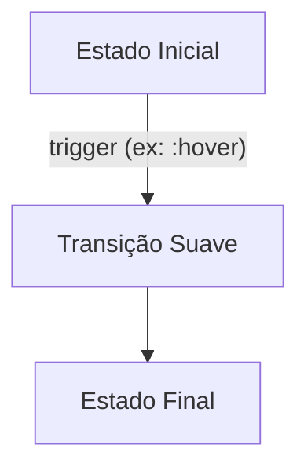
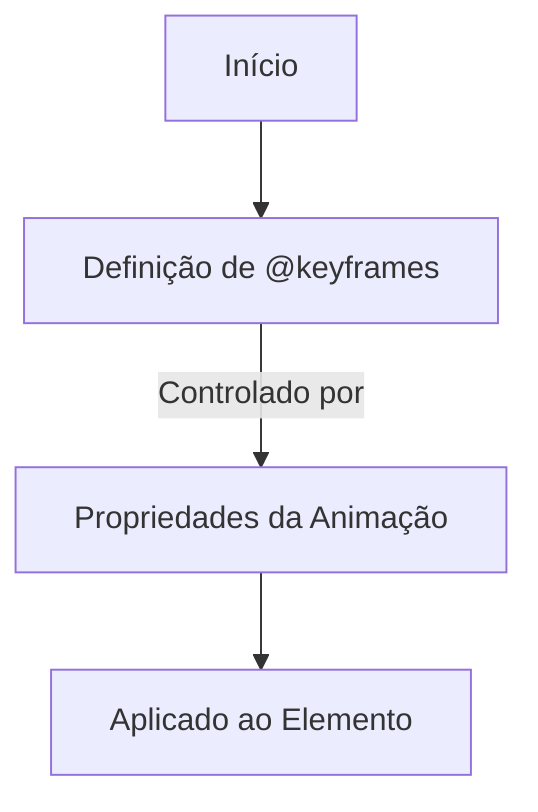
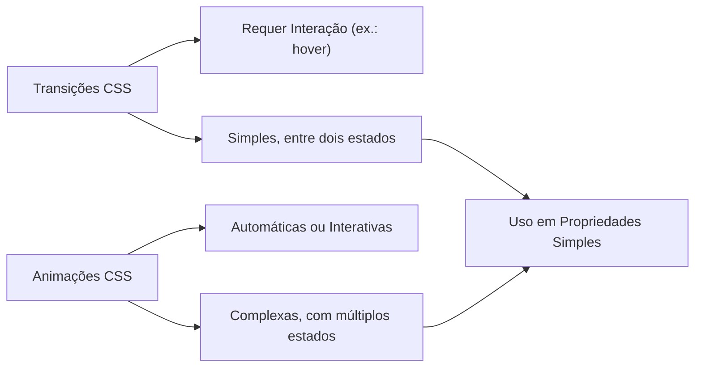

# 🎨 Transforme Seu Site com CSS: Guia Completo de Animações e Efeitos Surpreendentes ✨

Animações desempenham um papel crucial em melhorar a experiência do usuário em interfaces modernas, tornando-as mais dinâmicas, envolventes e intuitivas. No mundo do CSS, há duas principais formas de adicionar movimento aos seus elementos: **transições** e **animações**. Este guia técnico abordará essas duas abordagens e suas melhores práticas, incluindo exemplos avançados, dicas de desempenho e diagramas explicativos.

---

## **Transições CSS**

Transições CSS são usadas para animar alterações suaves em propriedades CSS, como cores, tamanhos ou posições.

### Estrutura de uma Transição CSS

Um diagrama simples mostra os elementos que configuram uma transição:



#### Propriedades Configuráveis

1. **`transition-property`**: Define a propriedade a ser animada (ex.: `background-color`).
2. **`transition-duration`**: Tempo de duração da animação.
3. **`transition-timing-function`**: Define como a animação progride (ex.: `ease`, `linear`).
4. **`transition-delay`**: Atraso antes do início da transição.

### Exemplo Prático

```css
.card {
  transform: scale(1);
  box-shadow: 0 4px 6px rgba(0, 0, 0, 0.1);
  transition: transform 0.3s ease-in-out, box-shadow 0.3s ease-in-out;
}

.card:hover {
  transform: scale(1.05);
  box-shadow: 0 8px 15px rgba(0, 0, 0, 0.2);
}
```

Neste exemplo, ao passar o mouse sobre o elemento `.card`, ele aumenta de tamanho e ajusta sua sombra para criar um efeito de elevação.

---

## **Animações CSS**

Enquanto as transições dependem de interações do usuário, animações CSS permitem movimentos mais complexos usando **keyframes**.

### Estrutura de uma Animação CSS

Diagrama que explica como os keyframes interagem com as propriedades de animação:



### Exemplo de Animação

```css
@keyframes bounce {
  0%, 100% {
    transform: translateY(0);
  }
  50% {
    transform: translateY(-20px);
  }
}

.ball {
  width: 50px;
  height: 50px;
  background-color: #ff5722;
  border-radius: 50%;
  animation: bounce 1s ease-in-out infinite;
}
```

No exemplo acima, a bolinha `.ball` "quica" continuamente, subindo e descendo de forma suave.

---

## **Comparação Entre Transições e Animações**

Um diagrama comparativo ajuda a entender as diferenças:



---

## **Boas Práticas**

### **Performance**
- Prefira `transform` e `opacity` para animações suaves.
- Use `will-change` para otimizar elementos que serão animados:

```css
.element {
  will-change: transform, opacity;
}
```

### **Acessibilidade**
- Use a regra `@media (prefers-reduced-motion)` para adaptar animações:

```css
@media (prefers-reduced-motion: reduce) {
  * {
    animation: none !important;
  }
}
```

### **Estratégias Consistentes**
- Utilize classes reutilizáveis para padronizar animações em todo o site.

---

## **Ferramentas Úteis**

1. **Bibliotecas CSS**:
   - [Animate.css](https://animate.style/): Biblioteca com dezenas de animações prontas.
   - [Hover.css](https://ianlunn.github.io/Hover/): Especializada em efeitos hover.

2. **Geradores de Animação**:
   - [CSS Animations Generator](https://cssanimation.io/): Geração de animações personalizadas sem esforço.

---

## **Conclusão**

As transições e animações CSS oferecem ferramentas poderosas para criar experiências envolventes e interativas. Transições são ideais para mudanças simples, enquanto animações proporcionam controle sobre movimentos complexos.

Invista na performance, adote boas práticas de acessibilidade e explore o poder criativo do CSS para transformar seus projetos! 🚀
